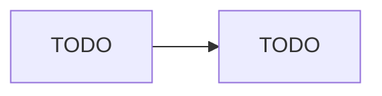

## System Principles and Constraints
All aspects of the Glean platform are developed and engineered under the following guiding principles:

1. The Glean system will be fully cloud-based and will primarily focus on SaaS applications.
2. Data should not leave the enterprise in the Glean architecture.
3. The system is designed to require minimal operational overhead. 

## Deployment Models
Glean is a SaaS solution where all customer tenants are hosted by Glean by default as part of our SaaS offering. Glean leverages Google Cloud Platform (GCP) for the underlying Infrastructure as a Service (IaaS) platform that our product is built on.

Glean also provides options for our customers to self-host their Glean tenant within their own GCP or AWS environment. This is called *Cloud-prem*.

:octicons-arrow-right-24: More information: [Glean Deployment Options](){:target="_blank"}.

## Architecture
### Single Tenant
Glean operates a *single-tenant* architecture, meaning that each customer tenant is built from scratch and is completely isolated from every other Glean customer tenant.

Specifically, for Glean SaaS, every Glean tenant is built within a separate GCP project, and at no point does any enterprise data indexed by Glean leave the customer project.

### High Level Design
The diagram below shows a high-level overview of all components within each Glean tenant.

For a more in-depth view of the Glean architecture, please contact your Glean Account Team. You will need to sign a mutal NDA.

### Components
The following GCP components are used for each Glean tenant:

* Compute Engine
* Vertex AI
* BigQuery
* Kubernetes Engine
* Stackdriver Logging, Monitoring, Trace
* Workflows
* Cloud Dataflow
* Cloud DNS and Cloud LoadBalancing
* Cloud SQL 8
* AI Platform Training & Prediction
* Cloud Storage
* Cloud Key Management Service
* Cloud Tasks
* Cloud Scheduler
* Cloud Build
* Cloud Functions
* Cloud Pub/Sub
* Cloud Run

