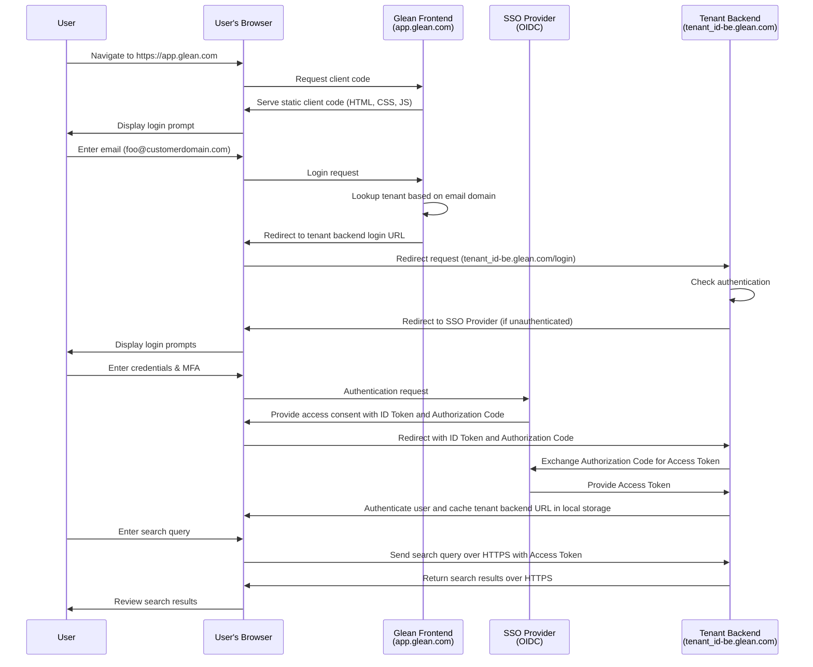

The Glean architecture consists of a data ingestion path, a query path, and data processing pipelines.

## Query Flow

### The Glean Web App
Users perform searches at [https://app.glean.com](https://app.glean.com){:target="_blank"}, which is a global web app hosted in Glean's cloud. We host the client code (a bunch of static images, CSS, JavaScript, etc) here. 

The web-app handler doesn’t have any complicated logic. It’s very simple, and just serves these static files that together form the "client code".

Once the client code is loaded in the browser, it looks at the user's local storage determines that there’s no state, i.e., the user is not logged in. All Glean searches are authenticated, so you need to login first; i.e., there’s no anonymous search.

At this point, the login flow begins. The user is prompted to enter an email address, e.g. `user@company.com`.

When a tenant is created, Glean requires a list of domain names that your company uses for authentication (e.g. `company.com`, `subsidiary.com`, etc) and maps these domains to the tenant backend domain (called the Query Endpoint, or QE) behind which your tenant (and all of its data) is hosted, i.e. `<tenant_id>-be.glean.com`.

When the user submits their email address, the Glean Web App performs a lookup of the associated domain, and responds with the QE domain of your Glean tenant, i.e. `<tenant_id>-be.glean.com`. The QE domain is cached in local storage in the user's browser, and at this point, all user interactions with the client go directly to the QE domain and not to `app.glean.com`.

At this stage, because the user is unauthenticated, the QE will redirect the user to the Single Sign-On (SSO) provider configured, where they will be prompted to sign-in. It is not possible to use Glean without configuring SSO.

After the user is authenticated, all queries and search results are transmitted over HTTPS between the user's browser and the QE asynchronously via XHR.

### Diagram

A diagram of the flow from unauthenticated user to query is included below (you may wish to zoom in to see the details).



### Examining Traffic to the Query Endpoint (QE)
Specifically, when a user executes a search, the client web app makes an asynchronous request to:

```
https://<tenant_id>-be.glean.com/api/v1/search
```

Examining the header of the request reveals the following:

```json
{
    "cursor": "[...snip...]",
    "maxSnippetSize": 324,
    "pageSize": 10,
    "people": [],
    "query": "expense policy",
    "requestOptions": {
        "debugOptions": {},
        "disableQueryAutocorrect": false,
        "facetBucketSize": 0,
        "facetFilters": [],
        "timezoneOffset": -660
    },
    "sc": "",
    "sessionInfo": {
        "lastSeen": "2023-12-13T05:03:49.808Z",
        "sessionTrackingToken": "[...snip...]",
        "lastQuery": "expense policy"
    },
    "sourceInfo": {
        "clientVersion": "fe-release-2023-12-05-86ae10d",
        "initiator": "MORE",
        "modality": "FULLPAGE"
    },
    "timeoutMillis": 10000,
    "timestamp": "2023-12-13T05:04:14.093Z",
    "trackingToken": "[...snip...]"
}
```

A description can be found in our [Developer Documentation](https://developers.glean.com/client/operation/search/){:target="_blank"}.

Examining the response of the request (some fields have been omitted for brevity):
```json
{
    "trackingToken": "[...snip...]",
    "sessionInfo": {
        "sessionTrackingToken": "[...snip...]",
        "lastSeen": "2023-12-13T05:04:14.385838873Z",
        "lastQuery": "expense policy"
    },
    "results": [
        {
            "trackingToken": "[...snip...]",
            "document": {
                "id": "GDRIVE_11[...snip...]Kp-P",
                "datasource": "gdrive",
                "docType": "pdf",
                "parentDocument": {
                    "id": "GDRIVE_1t[...snip...]qqsy",
                    "datasource": "gdrive",
                    "docType": "Folder",
                    "title": "Company Policies",
                    "url": "https://drive.google.com/drive/folders/1t[...snip...]qqsy"
                },
                "title": "CompanyExpensePolicy-sept2023.pdf",
                "url": "https://drive.google.com/file/d/11[...snip...]Kp-P",
                "metadata": {
                    "datasource": "gdrive",
                    "datasourceInstance": "gdrive",
                    "objectType": "pdf",
                    "container": "Insurance Policies",
                    "containerId": "GDRIVE_1t[...snip...]qqsy",
                    "mimeType": "application/pdf",
                    "documentId": "GDRIVE_11f...snip...]Kp-P",
                    "createTime": "2023-06-05T20:00:25Z",
                    "updateTime": "2023-06-16T11:59:42Z",
                    "author": {
                        "name": "Sam Sample",
                        "obfuscatedId": "B79[...snip...]3D8"
                    },
                    "owner": {
                        "name": "Sam Sample",
                        "obfuscatedId": "B79[...snip...]3D8"
                    },
                    "visibility": "SPECIFIC_PEOPLE_AND_GROUPS",
                    "assignedTo": {
                        "name": "Sam Sample",
                        "obfuscatedId": "B79[...snip...]3D8"
                    },
                    "updatedBy": {
                        "name": "Sam Sample",
                        "obfuscatedId": "B79[...snip...]3D8"
                    },
                    "datasourceId": "11[...snip...]Kp-P",
                    "interactions": {},
                    "documentCategory": "COLLABORATIVE_CONTENT"
                }
            },
            "title": "CompanyExpensePolicy-sept2023.pdf",
            "url": "https://drive.google.com/file/d/11[...snip...]Kp-P",
            "snippets": [
                {
                    "snippet": "",
                    "mimeType": "text/plain",
                    "text": "You can submit them to your manager using the current expense reporting method (current method here) within three months after the date of each expense. If your manager approves your expenses, you will receive your reimbursement within two pay periods on your regular paycheck."
                }
            ]
        },
        {...more results...}
    ],
    "errorInfo": {},
    "requestID": "[...snip...]",
    "backendTimeMillis": 89,
    "metadata": {
        "rewrittenQuery": "expense policy",
        "searchedQuery": "expense policy",
        "originalQuery": "expense policy"
    },
    "cursor": "[...snip...]",
    "hasMoreResults": true
}
```

## Data Ingestion Flow

For every enterprise datasource that is connected to Glean, we run a connector in the tenant's cloud project that fetches data and a permissions map from that source. These connectors run periodically and also in response to webhook events. The connectors store the fetched information into Glean’s document and identity store. A dataflow pipeline then runs which aggregates the content, the permissions/people data, and the activity data (creation date/edit date/view dates, etc) into the secure search index.

For each datasource, the connector code running inside your tenant's project fetches the content from the enterprise applications over HTTPS using public internet (if the application is SaaS e.g. Google Drive) or over a secure private link (if the application is hosted inside your network e.g. on-premises Jira).


## Data Processing Pipelines

Once the data is fetched, it is further processed within your tenant. All data processing happens using Google Dataflow pipelines, and your data never leaves the your tenant's project.
