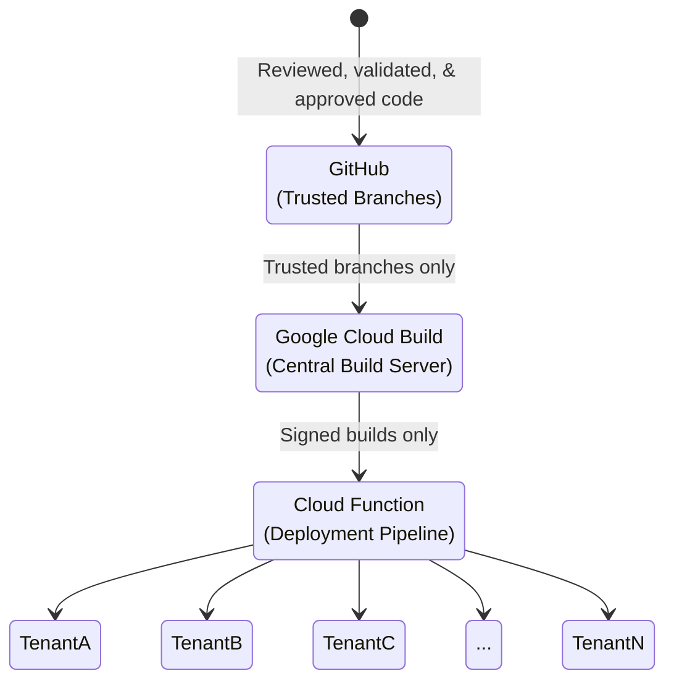

Glean's upgrade model is designed to ensure that our customers always have access to the latest features and improvements, while maintaining the highest level of security, privacy, and reliability.  This document describes the processes we follow to ensure that only trusted and verified code runs in the customer deployments.

## Trust Chain
At a high level, Glean's chain of trust for our Software Development Lifecycle (SDLC) is as follows:

## Process

### Code Releases

The Glean release branches are protected (code can only be submitted after review) and only allow signed commits.

GitHub Vulnerability Scanning is used here to assist in vulnerability detection.

### Building
A central locked down build service (implemented using Google Cloud Build) periodically reads code from trusted branches on Github.

The build service builds the relevant Docker containers and signs them using binary authorization. The build service is locked down so that only specified Glean engineers can access it. Additionally, these engineers can only trigger builds (and deploys) and cannot modify the build pipeline itself.

On build, Glean leverages the Google Cloud Platform (GCP) Web Security Scanner, the GCP Assets Scanner, and the GCP Container Registry Scanner as defence in depth mechanisms to detect any vulnerabilities that may have made it through code review and the GitHub Vulnerability Scanning process.

### Testing & QA
Our releases go through an internal soak and automated and manual QA testing, which includes [P0 security and permissions tests](https://docs.google.com/document/d/1J1EkBFjcJIqBdvA4kNYP7ebWoL8cgeHF5QQZXXyxTMQ/edit), before they are approved for deployment to customer tenants.

Glean has separate tenancies that are used for testing. No production and/or customer data is ever used in the testing process.

### Deployment
The central deployment workflow only has the capability to invoke a specific Cloud Function in the customer's Glean tenant. The Cloud Function that can be invoked takes the name of the release to upgrade to.

The Glean system self-upgrades to the signed release specified above by downloading the release from a trusted location after verifying the integrity using binary authorization.

## Additional Security Measures
In addition to the measures covered above, Glean ensures the following:

### Employee Access
Glean leverages Single Sign-On (SSO) with Multi-Factor Authentication (MFA) for access into all corporate systems. For Google Cloud, authentication sessions are limited to 24 hours and force re-authentication after this time.

Only Glean engineers have access to our private GitHub repositories, and of these engineers, only a small subset have IAM permissions to be able to trigger builds. Of the engineers that can trigger builds, none have the ability to modify the build pipelines.

### Security Exercises
Glean engineers regularly practice tabletop exercises to identify potential threats and how to mitigate them.

In additon, Glean conducts periodic penetration testing through an external firm (Cobalt).

!!! info
    A copy of the latest Glean pen test report is available under NDA. Please contact your Glean account team for more information.

### Compliance
Glean is SOC2 Type II compliant.

!!! info
    A copy of the full SOC2 Type II report is available under NDA. Please contact your Glean account team for more information.