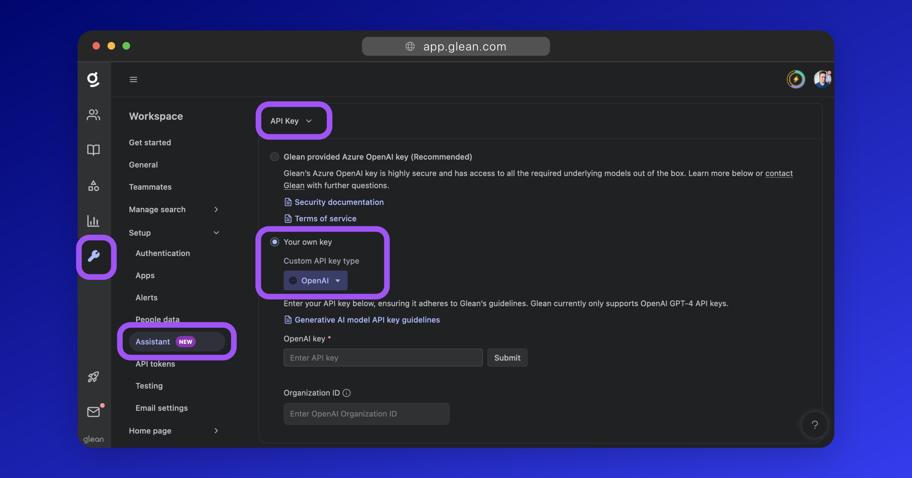
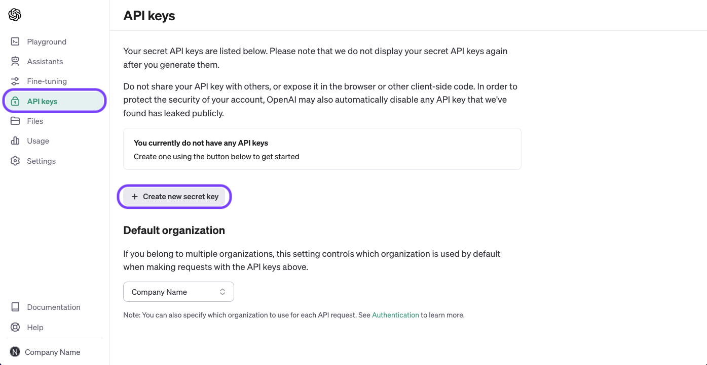
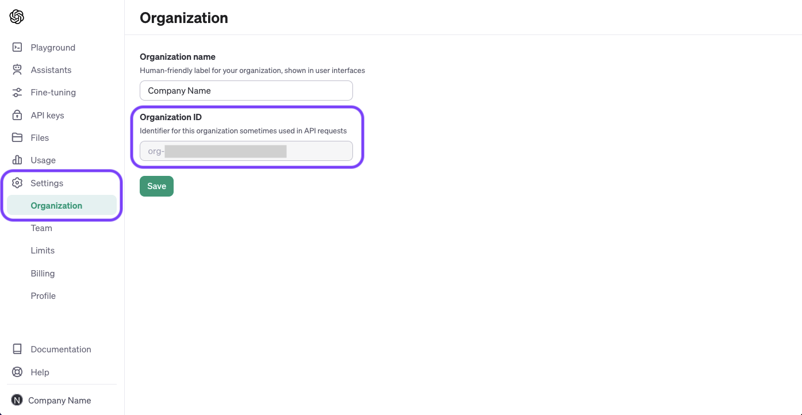
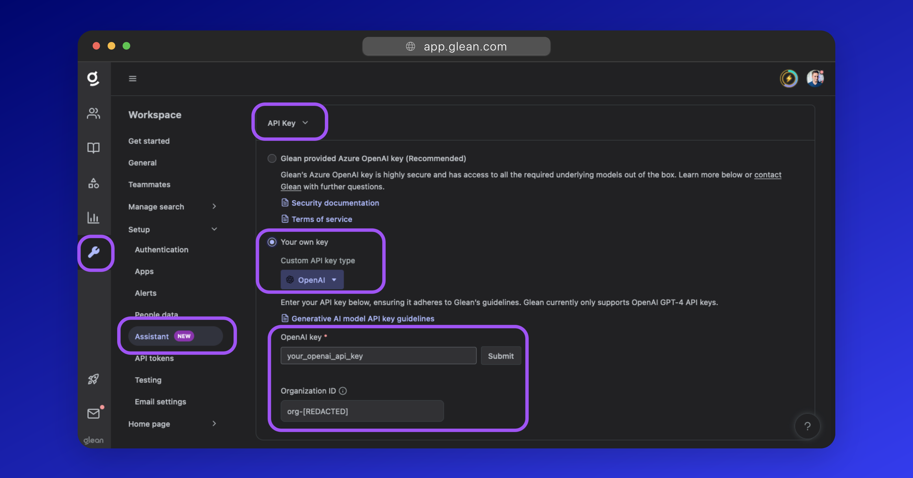
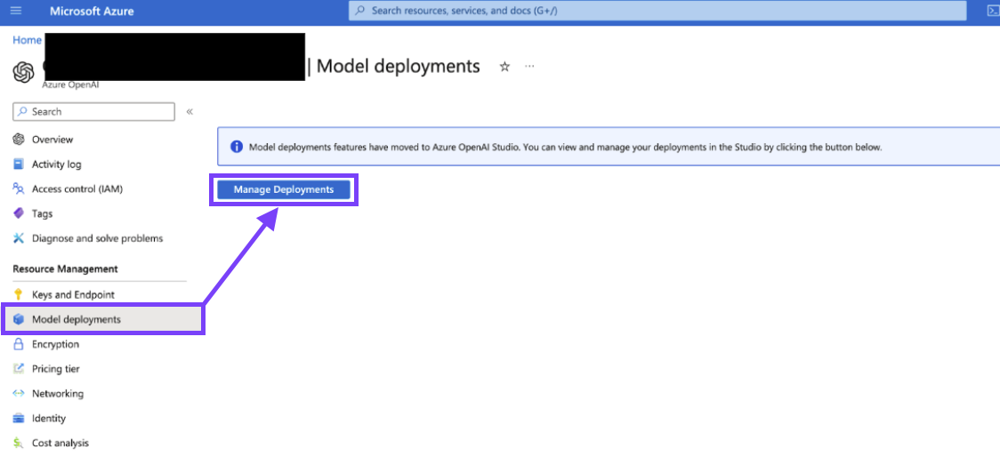
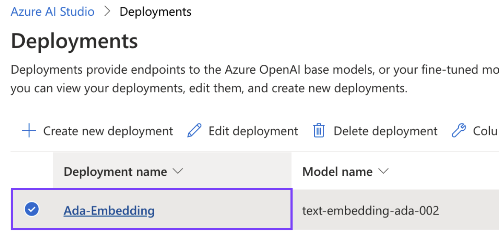

To enable Glean Generative AI features, you need to select a generative AI model and setup a key. If you elect to use GPT-4, we recommend using Glean's Azure OpenAI key. We also support using your own Azure OpenAI or “vanilla” OpenAI key. 

When using GPT-4 for Assistant, Glean's Azure OpenAI key is selected by default. To use your own GPT-4 key, follow the instructions below.

!!! warning "GPT-4 access is required"
    To use your own key, you will need GPT-4 access.

    * To access GPT-4 with Azure OpenAI, you need [access to the Azure OpenAI program](https://aka.ms/oai/access){:target="_blank"}.
    * To access GPT-4 with OpenAI, you must have made payment of [at least $1 or more into your OpenAI account](https://help.openai.com/en/articles/7102672-how-can-i-access-gpt-4){:target="_blank"}.

## Glean API Key vs BYO API Key
For GPT-4, Glean uses an Azure OpenAI key and has a special signed agreement with Azure OpenAI governing its use which promises:

* **0-day retention:** Your data will not be stored by Azure.
* **No training:** Data will **not** be used to train any custom large language models.
* **Data encryption:** All data is encrypted in transit.
* **Compliance:** Azure is compliant with a variety of industry standards. See details [here](https://azure.microsoft.com/en-us/products/cognitive-services/openai-service#security).

This provides several advantages over using your own key:

* **Guaranteed capacity:** You do not need to worry about having sufficient quota or quota exhaustion as you would with your own key.
* **Optimization:** Glean is able to make optimizations under the hood, and can deploy new models as they are available without any changes required by you.
* **Model access:** Glean provides access to all of the necessary models out of the box. You do not need to request access to these.
* **Default 0-day retention:** This is **not** the default when using your own Azure Open AI key.

## OpenAI GPT-4
Glean supports the use of your own provisioned OpenAI or Azure OpenAI key for Glean Assistant.

### Capacity Requirements
Capacity is expressed in Tokens per Minute (TPM) and Requests per Minute (RPM). You must have appropriate TPM and RPM quotas to facilitate Glean Assistant usage.

**Glean recommends 75 RPM and 25,000 TPM for every 500 users** (approximately 2 API calls per query).

For example:

* 150 RPM and 50k TPM for 1k users.
* 750 RPM and 250k TPM for 5k users.
* 1.5k RPM and 350k TPM for 10k users.
* 3k RPM and 500k TPM for 20k users.

### Access Requirements
To use your own key you will need access to **all** of the following models:

* GPT-4
* GPT4-32k
* GPT-3.5 turbo
* Embedding `text-ada-embedding-002`

??? warning "Access to GPT-4"
    GPT-4 access is a requirement to use your own key.

    * To access GPT-4 with Azure OpenAI, you need [access to the Azure OpenAI program](https://aka.ms/oai/access){:target="_blank"}.
    * To access GPT-4 with OpenAI, you must have made payment of [at least $1 or more into your OpenAI account](https://help.openai.com/en/articles/7102672-how-can-i-access-gpt-4){:target="_blank"}.

### Setting your Key

In the [Setup](https://app.glean.com/admin/setup/gleanassistant?tab=setup){:target="_blank"} tab under the [settings for Glean Assistant](https://app.glean.com/admin/setup/gleanassistant?tab=setup){:target="_blank"}, click to open the **API Key** dropdown, and set **Your own key** as the selected option.

Next, from the **Custom API key type** dropdown, select either **OpenAI** or **Azure OpenAI** (depending the key you have), and follow the instructions in the applicable section below.

#### OpenAI

You will need an OpenAI API Key and your OpenAI Organization ID to continue.

??? Info "Finding your OpenAI Key & Organization ID"

    **API Key**
    
    1. [Click here](https://platform.openai.com/api-keys){:target="_blank"} to go to the API keys section of the OpenAI Dashboard.
    2. Click **Create new secret key**.
    3. Provide the key with a name, eg: `Glean Assistant`, and click **Create secret key**.
    4. Copy the API key displayed. You won't be able to view it again after clicking away.
    
    
    
    **Organization ID**
    
    1. [Click here](https://platform.openai.com/account/organization){:target="_blank"} to go to the Organization settings of the OpenAI Dashboard.
    2. Copy the value listed under **Organization ID**.
    
    

1. To use an OpenAI API key, select **OpenAI** from the dropdown.
2. Paste your OpenAI *API Key* into the **OpenAI key** field.
3. Paste your OpenAI *Organization ID* into the **Organization ID** field.
4. Click **Submit** to validate and save your key.

#### Azure OpenAI

You will need the following to continue:

* Azure OpenAI Key & Endpoint.
* GPT-4 model deployment name.
* GPT4-32k model deployment name.
* GPT3.5-turbo model deployment name.
* `text-embedding-ada-002` embedding model deployment name.

??? info "Finding your Azure OpenAI Key & Endpoint"
    See: [Retrieve key and endpoint (learn.microsoft.com)](https://learn.microsoft.com/en-us/azure/ai-services/openai/tutorials/embeddings?tabs=python%2Ccommand-line#retrieve-key-and-endpoint){:target="_blank"}

??? info "Finding model deployment names"
    1. From the Azure Portal, search for and navigate to the *Azure OpenAI* page.
        2. On the left-side menu, select **Model deployments** then **Manage Deployments**
        
        3. On the **Deployments** page, you will see a list of all existing model deployments and the **Deployment name** specified for each.
        4. For each of the required models listed above, copy the **Deployment name**. This will be pasted into the Glean Admin UI.
        
        5. If you are missing some of the required models, or have no deployments, you will need to create a new deployment for each required model.

        a. Click the **Create new deployment** button.
    
        b. Select the required model from the list.
    
        c. Specify a deployment name.
    
        d. Set the **Content Filter** to **Default**.
    
        e. For quota recommendations, see [Capacity requirements](#capacity-requirements).
    
        f. Click **Create** to deploy the model.
    
        g. More information: [Create and deploy an Azure OpenAI Service resource (learn.microsoft.com)](https://learn.microsoft.com/en-us/azure/ai-services/openai/how-to/create-resource?pivots=web-portal){:target="_blank"}

To use use your Azure OpenAI key:

1. Select **Azure OpenAI** from the dropdown in the Glean UI.
2. Paste your Azure OpenAI key into the **Key 1** field.
3. Paste the endpoint URL into the **Endpoint** field (drop the `https://` as it is not required).
4. For each of the models listed, paste the deployment name into the field.
5. Click **Submit** to validate and save your settings.

## Google PaLM 2

PaLM 2 is currently in closed beta. Please contact your Glean account representitive for further information.

## Other Models

In our testing, other LLMs did not provide the quality of product we thought to be useful. We are constantly evaluating other models to determine their feasibility, however only models approved by Glean can be used at this time.

## Estimating API Usage Costs

!!! danger "This should be used as an estimate only and is subject to change"
    Since our system is continuously evolving, it’s hard for us to settle on a standard cost per query. We currently do not support configuring a limit.
    
    We recommend using Glean’s Azure OpenAI key so that you do not have to worry about the per query cost.

- Glean makes the following API calls for Assistant:
    - 2x GPT-4 calls for response generation.
    - 1x GPT-3.5-turbo call for follow-up question suggestions.
    - ~15 calls to `text-embedding-002`
- Average query token usage:
    - GPT-4: 4750 input tokens, 180 output tokens -> USD $0.1533 [99% of cost]
    - GPT-3.5-turbo: 760 input tokens, 129 output tokens -> USD $0.001398
    - `text-embedding–002`: 2250 input tokens -> USD $0.00022
- **Total cost: Approximately USD $0.15-0.16 per average query.**

*This estimate was last updated: October 13, 2023.*

