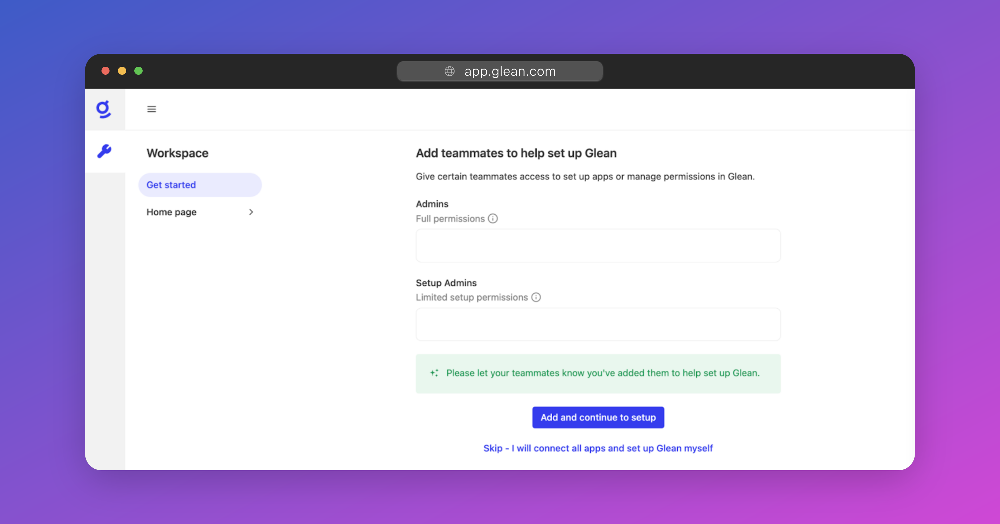

# Accessing the Admin User Interface

In this section we will cover how to access the Glean UI and begin setup for your organization.

## Sign In to the Admin Interface

To access the Glean Admin UI, navigate to [https://app.glean.com/admin](https://app.glean.com/admin) in your web browser. If you're not already logged in, you'll be prompted to do so. Enter your company email address to log in.

Because we have not configured Single Sign-On (SSO) yet, you will be prompted to check your email for a link to login. This is called a **Magic Link**. Click the Magic Link in your inbox to log in.

## Add Additional Administrators

The Glean Admin UI ([app.glean.com/admin](https://app.glean.com/admin)) is where you will manage the Glean workspace for your organization, including setting up Single Sign-On (SSO), configuring data sources, and syncing people data.

When you sign in for the first time, you will be prompted to add additional administrators before proceeding.

There are two types of administrator roles, **Full Admin** and **Setup Admin**:

* A **Full Admin** has full read/write privileges across the admin UI. They can add/remove other admins, manage user permissions, configure data sources, start crawls, and customize the Glean workspace for the organization.
* A **Setup Admin**, has restricted permissions and can only connect and configure data sources and start crawls. This is the perfect role to give to the administrators of any cloud applications you wish to connect to Glean.

See more: Administrator roles.

To proceed, add the emails of any additional users whom you wish to make a Glean administrator, or simply skip to the next step.

!!! warning
    Only select individuals within your organization should be granted Full Admin permissions.

!!! info "Hosting Glean in your own GCP or AWS?"
    You will need to follow the Self-Hosted Deployment Guide first before proceeding with the rest of this guide.