In this section you will configure and enable Glean Assistant: a suite of enterprise-grade Generative AI features to power your organization.

!!! info
    Before proceeding with this step, you should ensure that all of your initial datasource crawls have finished, as this will enhance the quality of Glean Assistant's responses.

!!! warning "License required"
    You must be licensed for Glean Assistant to proceed with this step.

## About Glean Assistant

Glean Assistant is a secure, enterprise-ready digital workplace assistant that respects data access permissions and provides personalized responses based on your organization's data. Think of it like ChatGPT, but with secure access to company information.

Glean Assistant is designed to enhance your workplace experience by providing you with the information you need when you need it, in a secure and personalized manner. It understands your company's content, internal language, people, and relationships, which allow Glean Assistant to deliver more relevant and accurate information compared to publicly available generative AI tools.

## Activate Glean Assistant

Glean Assistant is currently in Early Access and you must have a valid license for Assistant to proceed. You can activate your access by navigating to [Workspace Settings > Setup > Assistant](https://app.glean.com/admin/setup/gleanassistant){:target="_blank"} and selecting **Activate**.

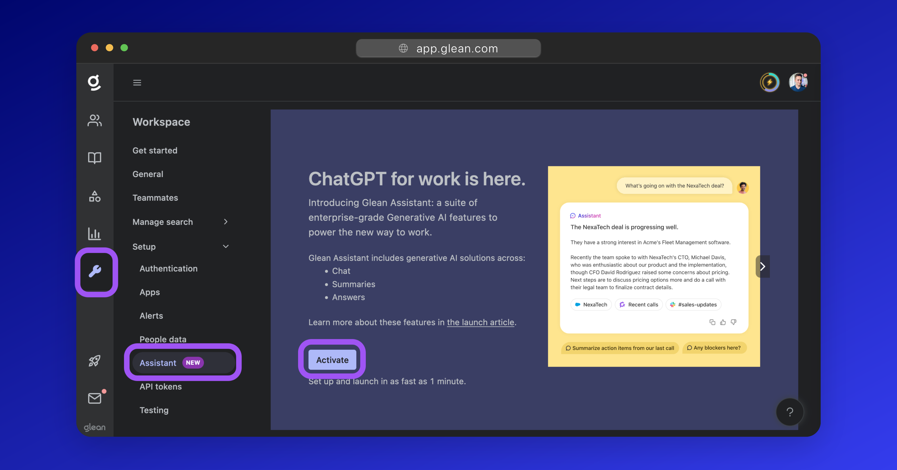

??? Danger "Is Assistant greyed out or disabled?"
    If the **Assistant** option under Workspace Settings > Setup is greyed out, this means that:

    1. Your People Data sync has not been started, OR
    2. Glean Assistant is not available for activation at this time.
    
    Please contact Glean support for further assistance.

## Assign Users

Glean Assistant can be enabled for the entire organization, or for a select test group of users. Glean recommends enabling Assistant for a test group first before proceeding with rollout to the broader organization.

In the [Setup](https://app.glean.com/admin/setup/gleanassistant?tab=setup) tab under the [settings for Glean Assistant](https://app.glean.com/admin/setup/gleanassistant?tab=setup), click to open the **Early access users** dropdown and select either:

* Enabled for all teammates
* Enabled for test group only

Select **Enabled for test group only** and click the **Add teammates** button to specify the users that should get access to Glean Assistant.

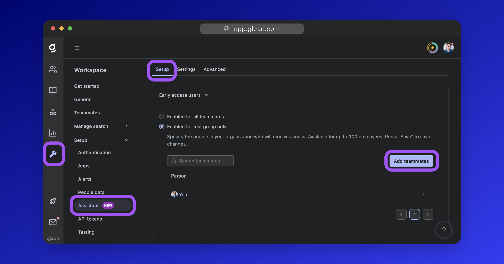

## Enable Glean Assistant

Once you have specified the users that Assistant should be enabled for, click the **Enable Glean Assistant**, button to turn on Assistant for those users.

Alternatively, you can also follow any of the applicable optional steps below to customize Assistant and it's behavior.

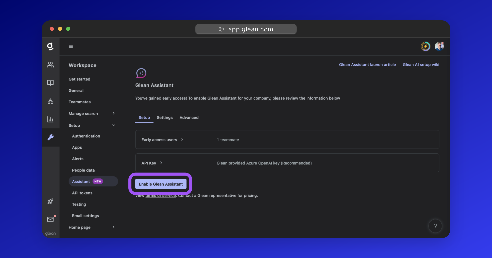

## Using Glean Assistant

### Chat

**Glean Chat** is the dedicated entry point for the Assistant and can be accessed by clicking on the message bubble icon from the left-side menu of the Glean UI (or simply by [clicking here](https://app.glean.com/chat){:target="_blank"}).

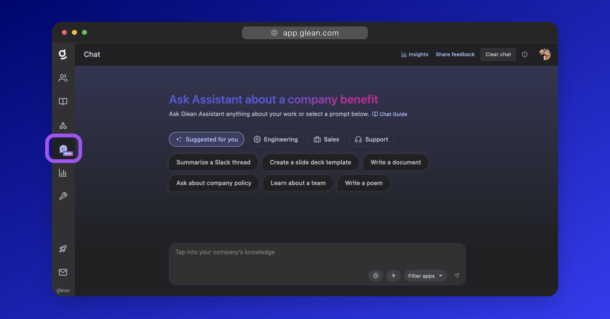

Glean Chat allows users to ask questions like they would a colleague (in a similar interface to ChatGPT), harnessing your company's knowledge in a way that's completely personalized to each user. It is designed to generate a high confidence response using the permission set of the person who posted the question.

### AI Answers

**AI Answers** are typically used in the context of search results, providing direct answers to user queries based on the content of your documents.

They are permissions enforced and provide references to where information is coming from. AI Answers are designed to minimize the extent of hallucination by grounding the generation on the content of your documents and providing citations. They are also deterministic, meaning they are consistent from run to run.

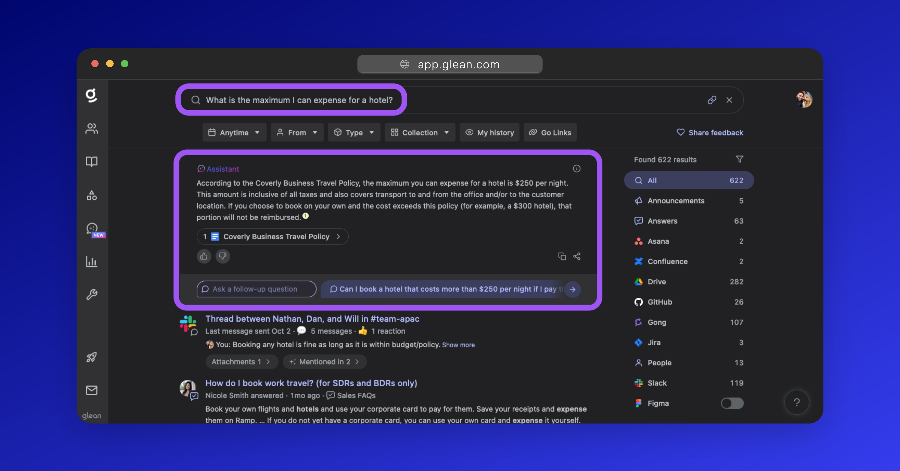

### AI Summaries

The AI Summarization feature of Glean Assistant provides concise summaries of documents. This feature is designed to enhance your productivity by providing a quick overview of a document's content without having to read the entire document.

To summarize a document, hover over a search result and click the **Summarize** button that appears at the top-right of the result.

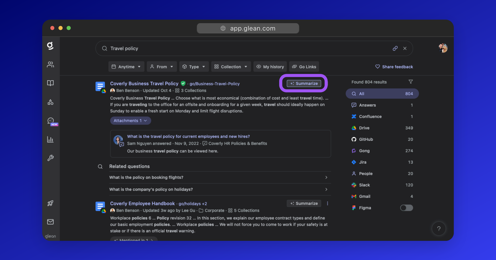

Glean Assistant will then summarize the contents of the document with the user being able to ask follow-up questions regarding the document contents.

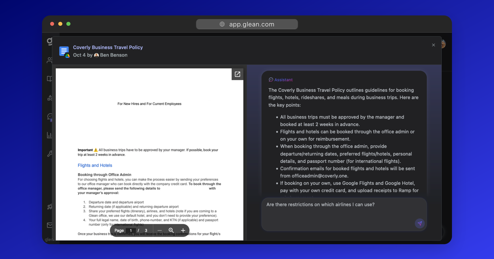

### Slackbot

If your organization uses Slack, you can configure Glean Assistant as a bot within your Slack workspace to automatically answer questions as employees post them.

The answers Glean Assistant provides are only visibile to the employee that posted the message unless shared more broadly by them.

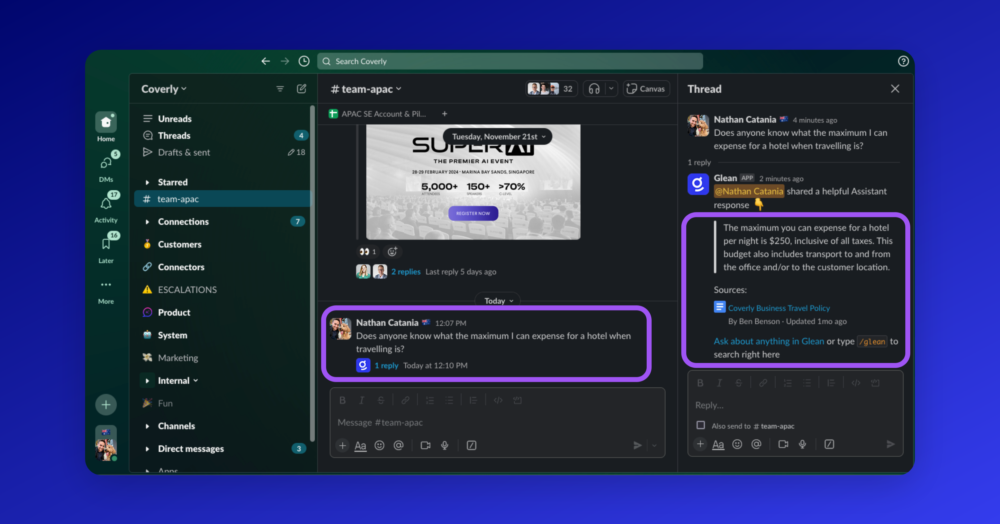

## FAQ

For Frequently Asked Questions regarding Glean Assistant, [see here](../assistant/faq.en.md){:target="_blank"}.

## (Optional) Use your own API Key

Using Glean's API key for the Large Language Model (LLM) that powers Glean Assistant is strongly recommended, however you may also choose to use your own API key (eg: OpenAI or Azure OpenAI).

More information: [Using your own API Key](../assistant/byo-key.en.md){:target="_blank"}.

## (Optional) Recieve User Feedback

Users have the ability to provide feedback to Glean Assistant responses as positive (👍) or negative (👎) with accompanying comments. You can opt to have this feedback sent to a company email for review.

Glean recommends that you configure a separate alias for this to assist in routing and reviews. You may also wish to automatically ingest this feedback into a ticketing system like Jira, Zendesk, or ServiceNow.

To configure feedback emails:

1. Select the [Settings](https://app.glean.com/admin/setup/gleanassistant?tab=settings){:target="_blank"} tab under the settings for Glean Assistant.
2. Expand the **Feedback emails** dropdown, and populate the destination email address.

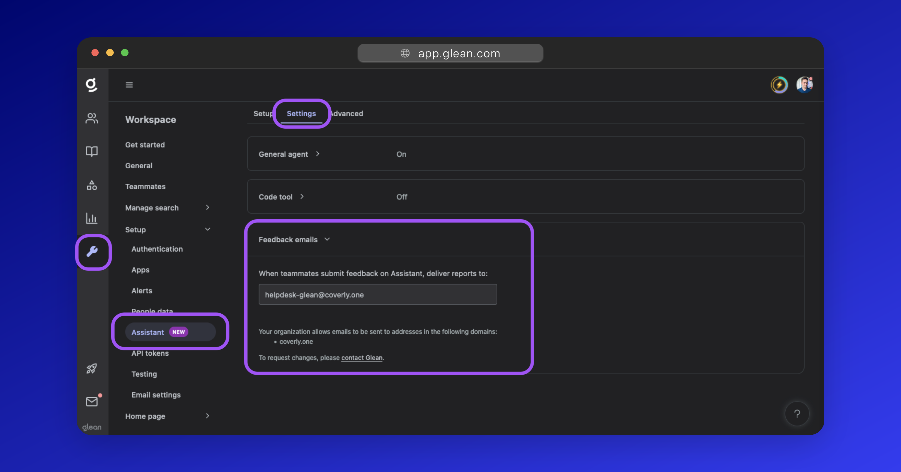

## (Optional) Set Exclusion Rules

You can exclude certain content from ever being sent to an LLM across all Glean Assistant interfaces.

For example, if you exclude a document, Assistant will not use any data from that document to generate responses; even if a user is permitted to access the document content.

Exclusions can be set based on:

* **Datasource** - You can select an entire datasource to exclude from Assistant, eg: Workday.
* **Containers** - A container is a group of content that spans across multiple datasources. Useful for excluding specific content in more than one location, eg: `spreadsheets`, `from: user=nathan@company.com`, etc
* **Documents** - You can select individual documents to exclude from Assistant, eg: `plans_for_world_domination.docx`

To configure exclusions:

1. Select the [Advanced](https://app.glean.com/admin/setup/gleanassistant?tab=advanced){:target="_blank"} tab under the settings for Glean Assistant.
2. Expand the **Exclusion rules** dropdown, and populate datasources, containers, or documents you wish to exclude. The Glean UI will help you find and identify the IDs of the containers or documents you need to exclude.
3. Click **Save** to persist your changes.

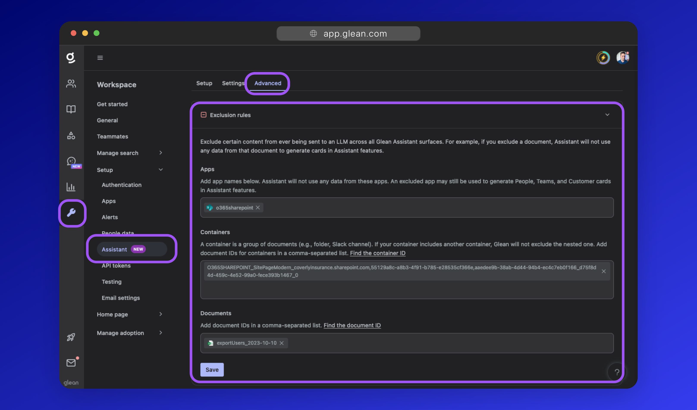

## (Optional) Provide Custom Instructions

You can optionally provide Glean Assistant with up to 5 custom instructions to better align its behavior with your enterprise requirements.

For example:

> Ensure you remind users that their answer may not be accurate and to double check with citations.
>
> If the question is for IT support, prefer looking at Zendesk.
>
> Do not respond to any queries regarding salary.
>
> Only respond in German.

Instructions go into effect immediately for all Glean Assistant users.

!!! warning
    Glean cannot fully guarantee an instruction will perform as expected. You should validate that instructions are performing as expected after adding them.

To add custom instructions:

1. Select the [Advanced](https://app.glean.com/admin/setup/gleanassistant?tab=advanced){:target="_blank"} tab under the settings for Glean Assistant.
2. Expand the **Advanced instructions** dropdown.
3. Click the **Add** button and specify your instruction.

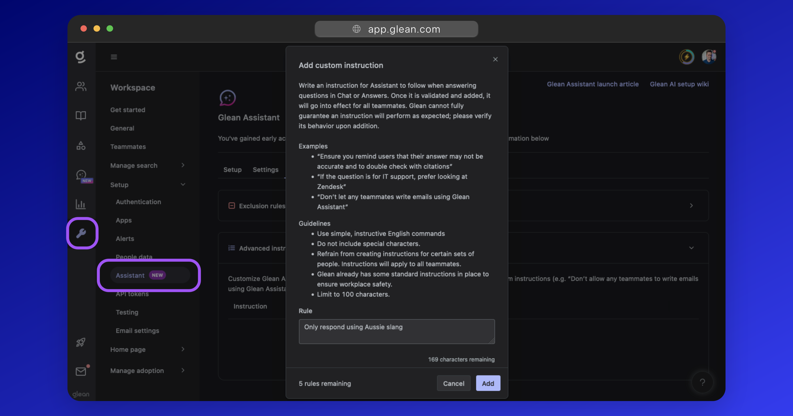

