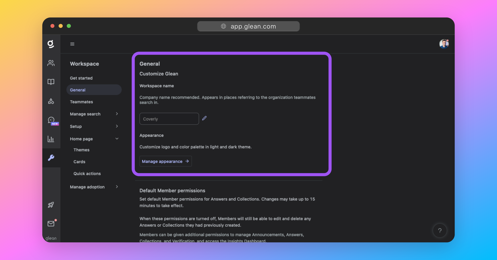
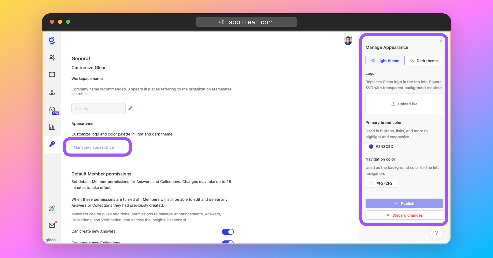
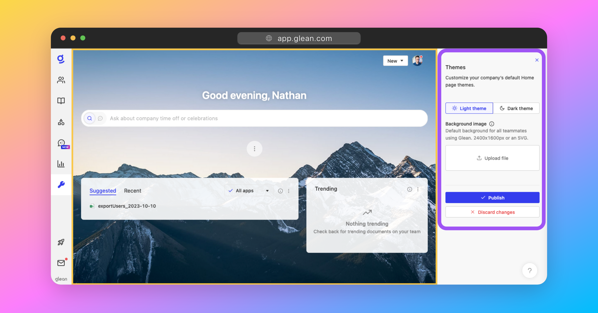
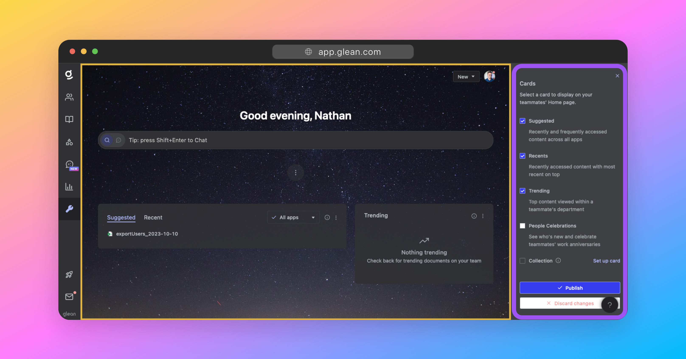
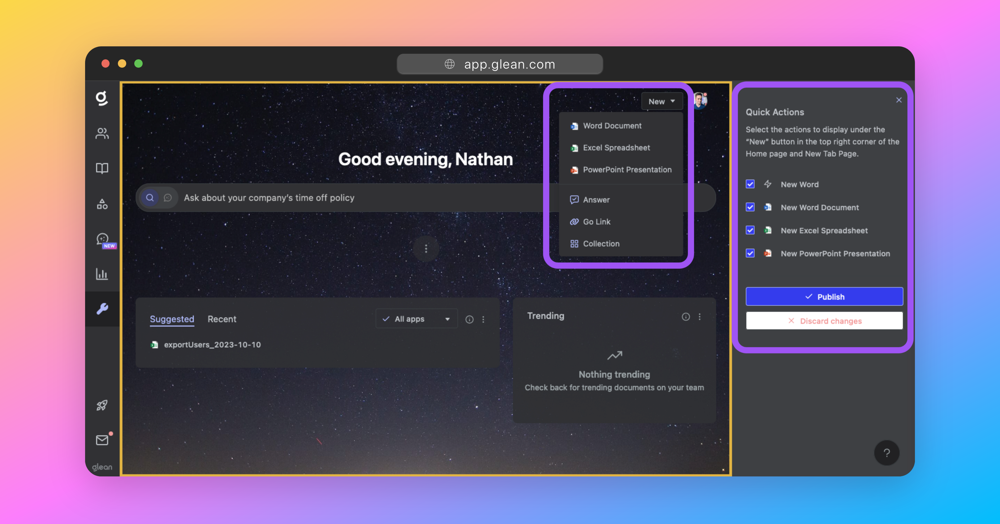

## About Workspace Customization
Every organization has its visual language, and Glean is here to ensure employees can feel at home while searching their company's data.

Administrators can control several aspects of Glean's look and feel to ensure that it fits with the rest of the tools that employees use at work. To access these configuration options, admins can open their organization's workspace settings.

The customization options for admins include the following:

* **Workspace name**: This is the name that appears in the search box after "Search for anything." Glean recommends setting this to the name of your company. 

* **Appearance**: These settings control the look of Glean everywhere, and include support for custom logos and colors.

* **Home page**: These settings control how the Glean home page appears to users across your company, and include settings for a default background image, quick actions and available home page widgets.

!!! info
    You must be assigned the **Full Admin** or **Super Admin** roles to be able to customize the workspace appearance.

---

## Workspace Name
`Workspace Settings > General > Workspace name` ([link](https://app.glean.com/admin/general){:target="_blank"})

This is the name that appears throughout the Glean UI in reference to your own company. Eg: The text in the search box that says "*Search for anything at `<Workspace Name>`*.

This will be set to the name of your company by default. If you require it to be changed, you can do so here.

---

## Appearance Settings
`Workspace Settings > General > Manage appearance` ([link](https://app.glean.com/admin/general){:target="_blank"})

The appearance menu includes all of the customization settings that impact the look and feel of Glean throughout the application. These settings will apply to all users at a company.

### Logo
The logo will replace the Glean logo in the upper left-hand corner of the navigation sidebar. It must meet the following criteria:

* Square aspect ratio
* Transparent background
* SVG format

If used, custom logos **must** be uploaded for both light mode and dark mode.

### Primary Brand Color
The primary brand color is the clearest way to bring your brand into a user's entire Glean experience.

It is used for links, monocolored icons, and a wide variety of other visual components throughout Glean.

!!! info
    You are not able to explicitly set the colors used for the Dark theme. These are derived automatically from the primary color set for the Light theme.

### Navigation Color
This color is the background for the left-hand navigation menu, which appears on all Glean pages except for the new tab page. 

!!! warning
    Glean will display an error if the color combinations selected are too low in contrast for sufficient accessibility.

!!! info
    You are not able to explicitly set the colors used for the Dark theme. These are derived automatically from the primary color set for the Light theme.

---

## Home Page Settings
`Workspace Settings > Home page`

The home page settings menu allows admins to define the look and feel of the Glean home page for employees at their company.

This is the primary place where your employees will interact with Glean across their workflows, and hence, is a logical place to share your company's visual identity.

### Themes
`Workspace Settings > Home page > Themes` ([link](https://app.glean.com/admin/preview/themes){:target="_blank"})

The *Themes* menu is where you can customize the default background image that is used for all users at your company when they first access the Glean. Users who have set their background from Glean's library will not have their choices affected by any change in the default background.

The images must be in `SVG` format, or be at least 2400 x 1600px. Larger images will be scaled down, with the initial aspect ratios retained. 

Different images can be set for light mode and dark mode.

### Cards
`Workspace Settings > Home page > Cards` ([link](https://app.glean.com/admin/preview/cards){:target="_blank"})
The *Cards* menu is where you can customize the widgets (known as *Cards*) that are visible on the Glean home page of your employees. There are a total of 5 cards that can be toggled:

* **Suggested**: Recently and frequently accessed content across all apps.
* **Recents**: Recently accessed content with most recent on top.
* **Trending**: Top content viewed within a teammate's department.
* **People Celebrations**: See who's new and celebrate teammates' work anniversaries.
* **Collection**: A list of resources organized by topic, eg: Common Corporate/HR Policies.
    * You must first add a collection under [Knowledge > Collections](https://app.glean.com/knowledge/collections).
    * This card can be targeted to different audiences. Eg: You might have an "On-boarding" collection show to employees with a start date less than 30 days ago.

### Quick Actions
`Workspace Settings > Home page > Quick Actions` ([link](https://app.glean.com/admin/preview/quickActions){:target="_blank"})

Customize the actions that are displayed under the **New** button in the top-right corner of the Home page and New Tab page.

