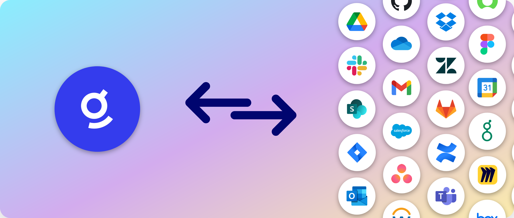
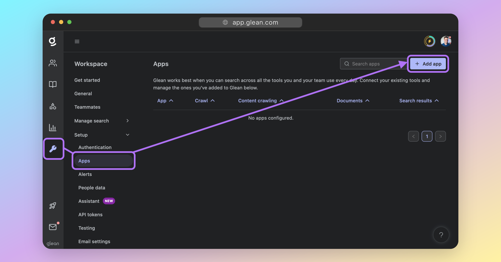
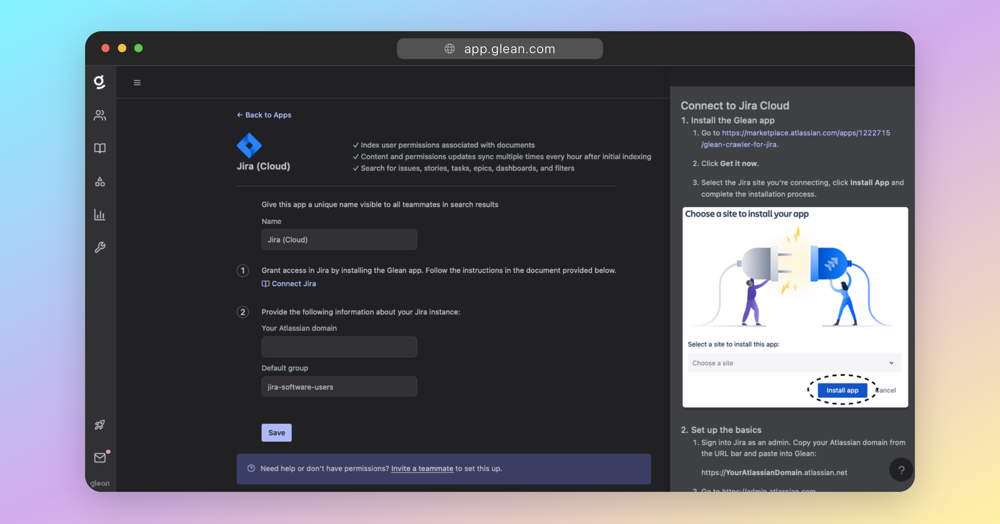
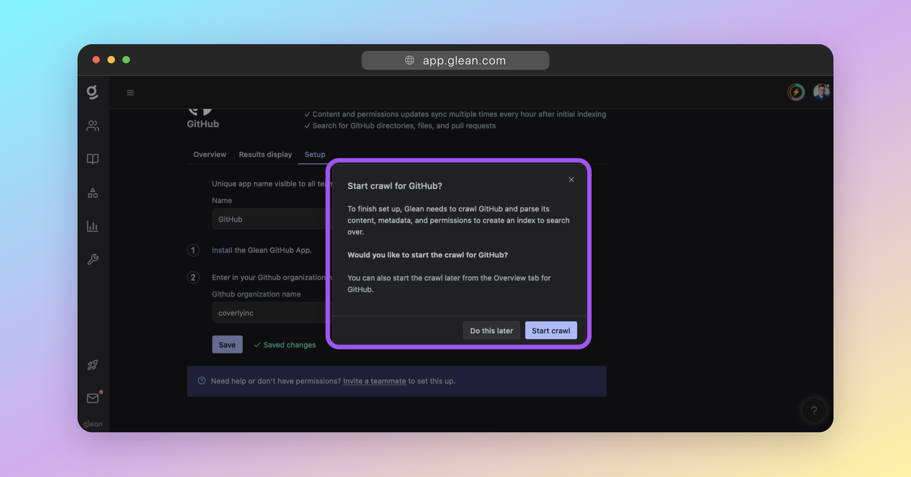
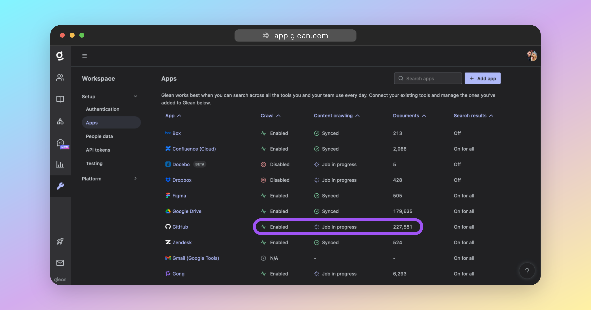

In this section, you will learn how to connect the sources of data that Glean will crawl and index for search.

## About Datasources and Connectors

### Datasources
**Datasources** are the platforms, services, or cloud apps where your data resides. These could be:

| Category | Example Apps                                 |
| -------------- | --------------------------------------------- |
| Cloud Storage   | Box, OneDrive             |
| Email    | Outlook, Gmail            |
| Communication        | Slack, Teams    |
| Documentation        | Confluence, Docusign |
| Ticketing & Support   | Jira, Zendesk      |
| Code & Engineering   | GitHub, BitBucket     |
| HR   | Workday, Lattice     |
| Sales & Marketing   | Salesforce, Marketo     |
| Project Management  | Asana, Monday     |
| [...and more!](https://www.glean.com/connectors)  |     |

### Connectors
**Connectors** are the tools that Glean uses to connect to your datasources and crawl data from them. Today, Glean supports 80+ connectors to different data sources.

Connectors typically pull data from your datasources securely over API, but may also recieve data from your datasources via a webhook.

## Select a Datasource to Connect

From the Glean UI, navigate to [Workspace Settings > Setup > Apps](https://app.glean.com/admin/setup/apps) and click the **Add app** button at the top-right.

Select the datasource that you want to connect Glean to and follow the instructions that are presented on-screen.

Connector configuration is typically achieved via OAuth and/or via installing Glean via your cloud app's marketplace/store (eg: Atlassian Marketplace).

As part of the setup flow for each connector, your API credentials and permissions will be validated.

!!! warning "Error prevention"
    It is critical that you apply any API access permissions in the setup documents **exactly** as referenced.
    
    For each item within a datasource, Glean will crawl 3 things:
    
    1. The item itself (ie: spreadsheet, document, message, email, event, etc)
    2. Access permissions for the item (ie: which users have access to the item)
    3. Activities performed on the item (ie: when was the item created/posted/modified/viewed/etc and by which users?)
    
    Glean only asks for the most minimal permissions perform the above, however this varies between datasources based on the capabilities of the API provided by the cloud service. For example: Some cloud services only expose document permissions via `ReadWrite` or `FullControl`, instead of a `ReadOnly` API scope.
    
    **Failure to set the correct API access permissions will cause your Glean crawl to fail.**

## Start Crawling
Once you have connected your datasource, you can initiate the crawl for it. This is the process where Glean goes through the data in your datasource and indexes it for search.

!!! info
    You will not be able to complete this step until your Glean tenant has been provisioned.
    
    If your tenant is still being built, you will need to return to this step later.

!!! warning
    If you would like to restrict the content that Glean crawls, DO NOT start crawling. Contact Glean support who can apply restrictions for you. Restrictions can also be applied from the UI after a full crawl has taken place.
    
    Restrictions supported vary between apps, but most support at least two of the following:
    
    1. Time-based restrictions (eg: Only crawl created or accessed in the last 6 months)
    2. User-based restrictions (eg: Only crawl content from the specified users)
    3. Group-based restrictions (eg: Only crawl content from the specified AD group)
    4. Site/channel-based restrictions (eg: Only crawl content from the specified site or channel)
    5. Folder-based restrictions (eg: Only crawl content from within the specified folders)
    
    For most apps, greenlisting (explicit inclusion), and redlisting (explicit exclusion) are typically both supported.

To start the crawl, click on the **Start crawl** button.

You can also start the crawl later by selecting the app under [Workspace Settings > Setup > Apps](https://app.glean.com/admin/setup/apps), and selecting **Start crawl**.

!!! tip "How long will a crawl take?"
    The initial crawl for any datasource will always take a while; the total time of which is dependant on two key factors:
    
    1. The size of the datasource (eg: number of documents/messages, and the size of each).
    2. The rate limit of datasource's API.
    
    If an API has a low rate limit, this will affect how quickly Glean can crawl it for items. Likewise, datasources containing a large number of documents, files, or messages, will also take longer to crawl.
    
    For a typical enterprise datasource, expect the initial crawl to take anywhere from 3 days, up to 10 days for large datasources with low API rate limits.

## Checking the Crawl Status

You can check the status of your crawl at any time by going to [Workspace Settings > Setup > Apps](https://app.glean.com/admin/setup/apps) and reviewing the table of configured apps.

Here, you will see information about the progress of the crawl, including how many documents have been indexed and any errors that may have occurred.

!!! tip
    For crawls of large datasources, or datasources with low rate limits, it is normal for the document count to be low initially and then exponentially increase over the span of a few days.

    If the document count remains low after a few days, please check the permissions granted to the Glean connector and contact Glean support.

## FAQ

!!! quote "Q: How long will my crawl take?"
The initial crawl for any datasource will always take a while; the total time of which is dependant on two key factors:
    
1. The size of the datasource (eg: number of documents/messages, and the size of each).
2. The rate limit of datasource's API.
   

If an API has a low rate limit, this will affect how quickly Glean can crawl it for items. Likewise, datasources containing a large number of documents, files, or messages, will also take longer to crawl.

For a typical enterprise datasource, expect the initial crawl to take anywhere from 3 days, up to 10 days for large datasources with low API rate limits.

!!! quote "Q: What if my crawl is taking a long time?"
The duration of the crawl depends on the amount of data in your datasource. Larger datasets, or apps with low API rate limits, will take longer to crawl. If your crawl is taking longer than expected, please contact Glean support.

!!! quote "Q: I don't want Glean to crawl everything. How do I restrict what is crawled?"
Some connectors support configuring restrictions at setup time from the UI (eg: GitHub), but for most datasources you will need to contact Glean support to have crawl restrictions applied. There are multiple ways to restrict the data crawled, including:

1. Time-based restrictions (eg: Only crawl created or accessed in the last 6 months)
2. User-based restrictions (eg: Only crawl content from the specified users)
3. Group-based restrictions (eg: Only crawl content from the specified AD group)
4. Site/channel-based restrictions (eg: Only crawl content from the specified site or channel)
5. Folder-based restrictions (eg: Only crawl content from within the specified folders)

The restrictions that can be applied are dependant on the datasource and what is available via the API. For most apps, greenlisting (explicit inclusion), and redlisting (explicit exclusion) are typically both supported.

!!! quote "Q: What if I see errors in my crawl status?" 
If you see errors in your crawl status, this could indicate a problem with the connection to your datasource or with the data itself. Please check your datasource configuration and contact Glean support if the issue persists.

!!! quote "Q: Can I crawl multiple datasources at the same time?" 
Yes, Glean supports crawling multiple datasources simultaneously.

!!! quote "Q: How can I see the progress of a crawl?" 

If a crawl is in progress, the status under the **Content crawling** heading in the table of apps with be **Job in progress**. When a crawl is complete this field will show **Synced**. It is not currently possible to see more detailed crawl progress or an ETA.

!!! quote "Q: The crawl seems stuck at _Job in progress_?" 

**Job in progress** means that there is an active crawl of that datasource underway. Remember: a full crawl of the datasource will take several days to complete, and so the status of the datasource will be **Job in progress** during this time.

!!! quote "Q: How do I delete a datasource?" 

Contact Glean support who will remove it for you.

!!! quote "Q: How do I stop or restart a crawl?" 

Contact Glean support who can do this for you.
