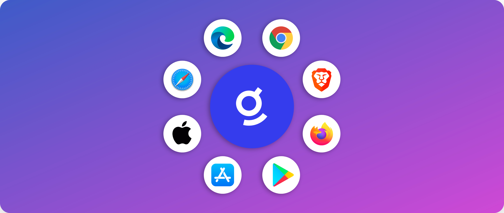
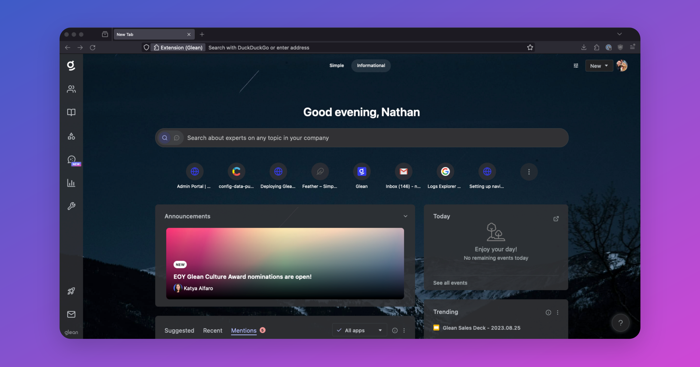
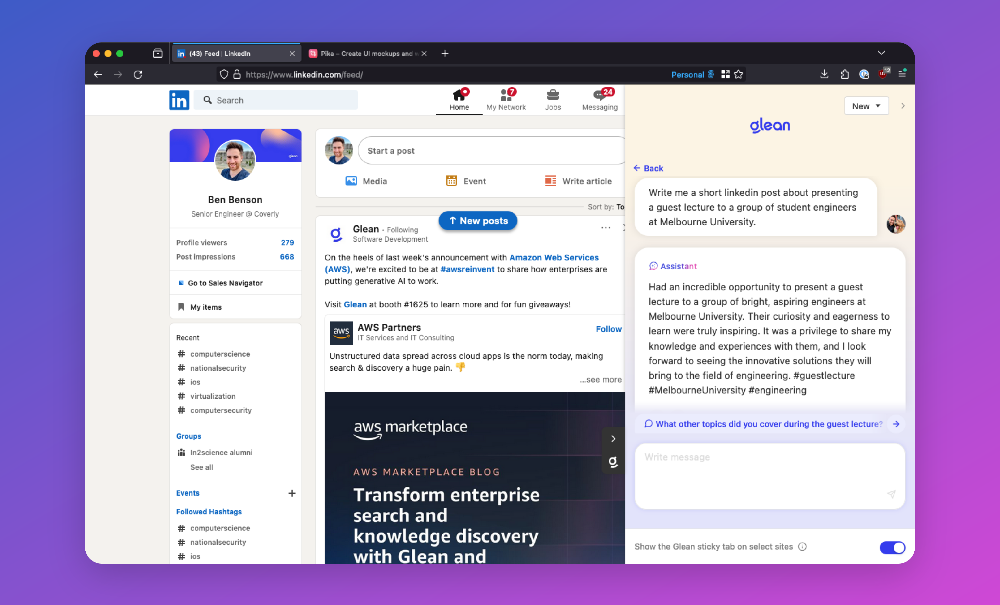
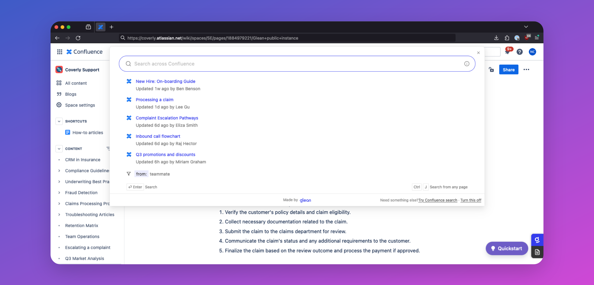
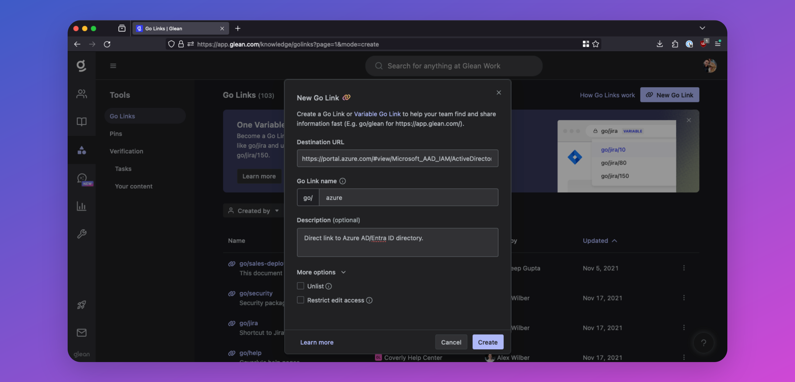
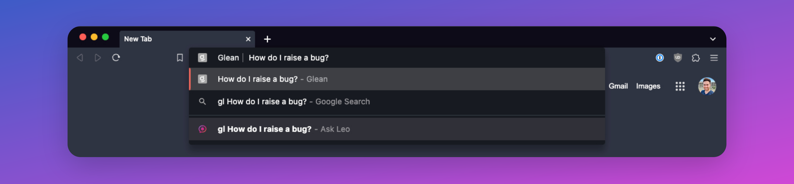
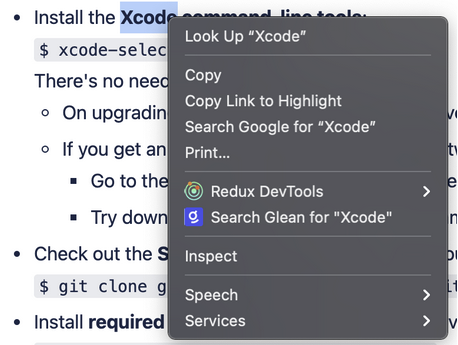
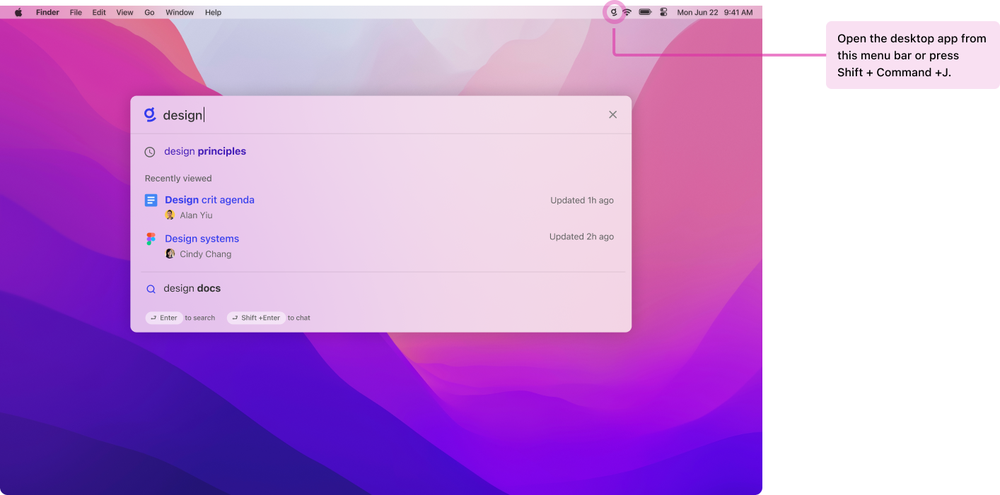
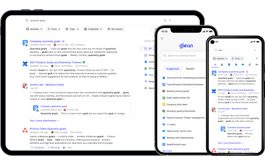

## About the Glean Browser Extension & Apps
By default, a user must access Glean by explicitly typing `https://app.glean.com` into their browser, or by clicking the Glean tile in your company's SSO App Library. Both of these options have significant friction to them, and on their own, lead to poor adoption of Glean.

The best way to drive Glean adoption at your company is by deploying the browser extension and apps to their corporate devices.

## Browser Extensions
The Glean Browser Extension provides a better user experience and creates habits for higher adoption and usage, allowing everyone to get the most out of Glean.

Key benefits include:

* Higher employee adoption and usage.
* Better admin insights to understand employee needs.
* Better search results
* Access Glean search from anywhere to increase efficiency
* Increased visibility to company resources and announcements
* Get search results from additional platforms even if the app isn’t connected to Glean
* Easier to discover relevant and trending content

### Supported Browsers
The Glean Browser Extension is available for:

* :fontawesome-brands-chrome: [Chrome](https://chrome.google.com/webstore/detail/glean/cfpdompphcacgpjfbonkdokgjhgabpij){:target="_blank"}
* :fontawesome-brands-firefox: [Firefox](https://addons.mozilla.org/en-US/firefox/addon/glean/){:target="_blank"}
* :fontawesome-brands-edge: [Edge](https://chrome.google.com/webstore/detail/glean/cfpdompphcacgpjfbonkdokgjhgabpij){:target="_blank"}
    * You must enable the [Allow extensions from other stores](https://support.microsoft.com/en-us/microsoft-edge/add-turn-off-or-remove-extensions-in-microsoft-edge-9c0ec68c-2fbc-2f2c-9ff0-bdc76f46b026){:target="_blank"} setting to install Glean.
* :fontawesome-brands-safari: [Safari](https://apps.apple.com/us/app/glean-for-safari/id6444195239?mt=12){:target="_blank"}
* :simple-brave: [Brave](https://chrome.google.com/webstore/detail/glean/cfpdompphcacgpjfbonkdokgjhgabpij){:target="_blank"}

### Extension Features
#### New Tab Page
The default New Tab Page is replaced with Glean’s search for quick access to search, suggested items, and calendar.



#### Sidebar
Open Glean search or Assistant in a sidebar on **any** page. This allows for a quick search without breaking flow. On some apps, the sidebar can be accessed via sticky tabs on the right.



#### Native Search Replacement (Embedded Search)
Glean can make searches within other apps better! Clicking or focusing the native search box on Box, Confluence, Google Drive, and Jira opens Glean search instantly in a modal dialog where typing continues to get Glean’s more relevant results.



#### Go Links
Go Links are short, memorable links that redirect to important URLs within your company. For example, you could create `go/401k` for your company’s 401k portal, `go/it-help` for your IT help desk, or `go/sprint-planning` for your Jira project.

The Glean browser extension enables the use of these Go Links directly from your browser. Simply type your Go Link in the browser URL bar (e.g., `go/onboarding`), and you'll get automatically redirected to the corresponding URL.



#### Browser History Search Results
For specific workplace apps in which Glean cannot build out a native connector (typically due to a limited API from the app vendor), the Glean extension can be used in place to allow employees to see results and suggestions from these apps; pulled from their browser history.

Glean will be able to search across the titles of the pages your employees have visited, but because these are history-based results, users will only be able to view content that they have seen before in these workplace apps. 

Results from a user's browser history are completely secure and private to the individual user: the company will not be able to see results from a user's browser history.

#### URL Bar Search
Type `Gl`+`tab` in any Chromium browser to search Glean directly from the URL bar.


#### Search from Context Menus
Right-clicking a word or phrase provides an option to search Glean for it.



#### Activity Signals
When using Glean, the extension reports user activity and events back to your Glean tenant so that Glean can provide:

* **Enhanced search result personalization**: Glean leverages activity data reported by the extension to learn the relevance of a document and its groupings within an application. This allows Glean to deliver a higher degree of personalization than without the browser extension.

* **Content suggestions**: Activity data obtained from the extension helps Glean learn and proactively suggest content that a user might be interested in at any point in time.

* **Insights**: The enhanced activity data provides additional analytics available to admins in the Insights dashboard. Glean also uses data captured by the extension (like dwell time) to help improve search rankings.

??? info "What information is sent by the browser extension?"
    
    * Each event consists of the page URL, title, referring page URL, visit timestamp, dwell time, and the one-way hash encrypted user ID.
    
    * Events are only reported for the limited set of URLs that belong to workplace apps that are configured to be connected to Glean (including both API connected and browser history enabled). They’re not sent for all domains to which the extension has host permissions.

    * Care is taken to also prevent this activity reporting for personal instances of an app that is also used in the workplace (e.g. Gmail and Google Drive with an account other than the one logged into Glean are excluded).


### Deploying the Browser Extension
The Glean Browser extension can either be manually installed by your users or pushed to managed devices by your admins.

=== "Managed Chrome"
    To facilitate adoption and usage, a company-managed rollout of the Glean Chrome extension can be pushed to all employees. This means all employees will automatically have Glean’s Chrome extension installed on company-managed computers.

    Users will not be able to disable/uninstall the extension if it is installed through Managed Chrome.

    **Installation**

    1. Ensure you have or work with someone who has Google Workspace Admin privileges.
    2. Go to [https://admin.google.com/ac/chrome/apps/user](https://admin.google.com/ac/chrome/apps/user){:target="_blank"}
    3. Use the left bar to choose the organizational unit you would like to deploy the extension to.

        !!! tip
            Even if the extension is being rolled out company-wide, it is a good idea to select a company-wide organizational unit so that the extension will only be pushed on the Chrome profile associated with employees' work accounts.
    4. Hover over the + button in the bottom right corner and select "**Add from Chrome Web Store**".
    5. Search for “Glean” and select the option corresponding to the Glean work extension.
    6. Click **Select** at the top-right. When the extension appears, click on it to open the right nav bar.
    7. In **Policy for extensions** enter:
        ```
        { "BaseUrl": { "Value": "https://<INSTANCE_NAME>-be.glean.com" }}
        ```
        To confirm your instance name, please contact Glean support.
    8. Click **Save**.
    9. Hover over the **Installation Policy** for the extension and select either **Force Install** or **Force Install + pin to browser toolbar**.
    10. Click **Save**.
    
    !!! success
        You’re all set!
        
        There may be a delay on the Google/Chrome side for when the extension is pushed. Expect all employees to have the extension present within 24-48 hours.


=== "Managed Edge"
    To facilitate adoption and usage, the Glean Edge extension can be pushed by company admins to all managed devices. Users will not be able to disable/uninstall the extension if it is installed through Managed Edge / Group Policy.

    You can use the [ExtensionInstallForceList](https://learn.microsoft.com/en-us/DeployEdge/microsoft-edge-policies#extensioninstallforcelist){:target="_blank"} policy to install the Glean extension silently.

    **Installation**

    1. In the Group Policy Editor, go to **Administrative Templates** > **Microsoft Edge** > **Extensions** > and then select **Control which extensions are installed silently**.

    2. Select **Enabled**.

    3. Click **Show**.

    4. Enter the following ID to install the Glean extension from the Chrome web store:
        ```
        cfpdompphcacgpjfbonkdokgjhgabpij;https://clients2.google.com/service/update2/crx
        ```

    !!! success
        You're all set!

        The extension is installed silently without user interaction. The user also won't be able to uninstall or disable the extension. This setting overwrites any blocklist policy that is enabled.


=== "Email Template"
    Refer to below email template below for a company-wide communication to inform of a managed Chrome/Edge install.

    **Subject: New browser extension available for all employees**
    
    *Title: Key updates to your browser*

    In [company name]’s continued effort to support employee well-being and productivity, we are rolling out a new company-wide search tool, [Glean](https://www.glean.com/).
    
    Using Glean, you can search across all work applications we use at [company name]. Whether the document or answer you are looking for lives in [GDrive, Slack, Email, Jira *customize with your company's tools] or with another colleague, Glean will help you search for and discover what you need to get your work done. All without remembering where all your documents are hosted or messaging multiple people. 

    Starting [launch date], Glean will be installed on your Chrome browser. Note that this launch will replace your current default new tab page with Glean so you can easily [access search across all apps](https://help.glean.com/en/articles/4712824-search-from-wherever-you-work). 


## macOS App
Glean's macOS app provides your users with a spotlight-like search experience where you can search across all the tools your company has in use.

Open it from anywhere with just a few keystrokes (`Shift+Cmd+J`) to start a Glean search.

Glean for macOS can be downloaded from the [Mac App Store](https://apps.apple.com/us/app/glean-desktop/id6448766375?mt=12){:target="_blank"}, or directly via the links below:

* [PKG](https://storage.googleapis.com/glean-downloads/glean-desktop-app/Glean.pkg) (Recommended)
* [DMG](https://storage.googleapis.com/glean-downloads/glean-desktop-app/Glean.dmg)



## iOS & Android Apps
Deploy the Glean mobile apps to your managed devices to help your employees find exactly what they need when they need it. Access Glean Search and Glean Assistant on the go from anywhere!

* [iOS App Store](https://apps.apple.com/app/id1582892407){:target="_blank"}
* [Google Play Store](https://play.google.com/store/apps/details?id=com.glean.app){:target="_blank"}



