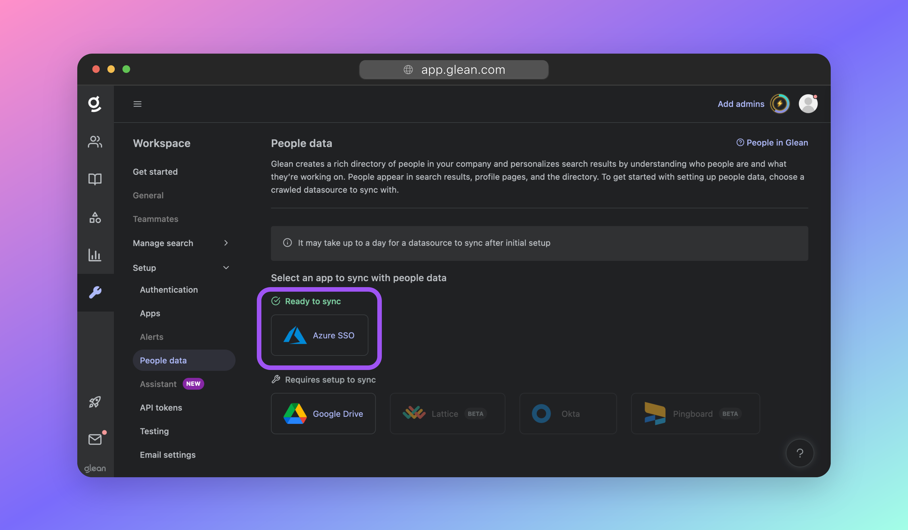
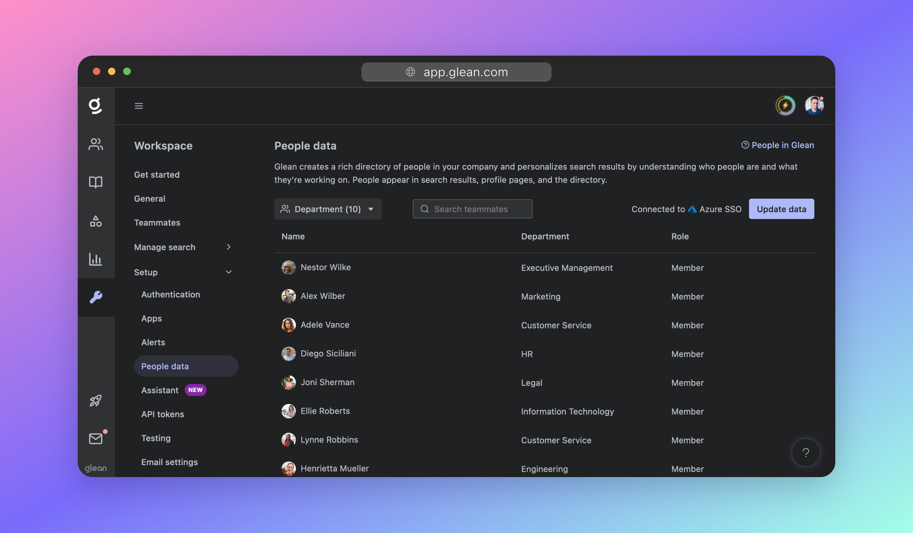

# Sync People Data

In this section you will synchronize your employee directory (ie: _People Data_) to Glean.

!!! info
    You will not be able to complete this step until your Glean tenant has been provisioned.
    
    If your tenant is still being built, you will need to return to this step later.


## About People Data
Synchronizing people data to Glean is a critical part of the setup process, as it allows Glean to enforce document permissions and deliver relevant results in search.

It is also used to create a list of teammates for managing access to features and content.

!!! tip
    If you configured SSO using OIDC in the last step, and your directory is the same as your SSO platform (eg: Azure AD/Entra ID, Okta), then you have already configured people data sync as part of the SSO configuration, and now simply need to enable it.

## Configure People Data Sync

!!! warning "Using SAML or a People Data source not listed?"
    You will need to manually upload your directory data to Glean. Click here for more information.

Navigate to **Workspace settings** > **Setup** > **People data**.

If your SSO platform supports directory synchronization, it will be listed here with a green checkmark and status **Ready to sync**. Click the SSO provider's icon to proceed.



If you wish to setup an alternative source, click the appropriate service and follow the setup instructions. If your data source is not listed, please contact Glean support.


### Attribute Mapping

On the next screen, and if your People Data source supports it, you will be able to map attributes from your directory to the required field in Glean. This is useful if you store user information in a different way than what is standard.

For example, you might want to infer a user’s location from their manager’s location. If they have an Okta field called `managerLocation`, you could map `managerLocation` to the Glean attribute `location`.

If your People Data source does not support custom mapping in the Glean interface, you will not see this option. Please contact Glean support if you require this feature but do not see it for your configured People Data source.

<picture>

### Initiate the sync

Before you start the sync, you can preview what information will included. For example, how many users will be created, and how many departments you have. If this is different to what you expected, check that you have provided the correct permissions within the People Data source.

Click **Start sync** to begin synchronization. From this point onwards the sync is automatic: Glean will check-in with your People Data source periodically for any changes.


### Verification

The People Data sync will start, and over the next hour, you will start to see your employee directory being populated.

The synchronization is not immediate: Glean needs to crawl your people data first, and then index it so that it is useable in search. **This can take 2-3 hours to fully complete.**

You can return to this page later to validate that your sync is working.



??? Danger "Having issues?"
    If you do not see people data start to show up within a few hours, this typically points to a permissions issue: Ensure that you have provided Glean with the correct permissions within your IdP when you configured SSO.
    
    For example, for Azure AD, it is critical to have `Directory.Read.All` and `User.Read.All` as **Application permissions** NOT Delegated Permissions.
    
    If your issues persist, please contact Glean support.

## Manual Upload (.csv)

!!! Failure "Not recommended"
    This method should only be used as a last resort, or if you configured SSO via SAML instead of OIDC.

For instances where your directory information cannot be automatically synchronized, Glean also supports the manual upload of people data as a set of comma-separated values `.csv`.

Because this method is not autonomous, Glean does not recommend it. Any updates to your directory (new employees, departures, or changes) will require you to re-upload a new CSV.

### CSV Format

The following are **mandatory** fields:

| Required Field | Description                                   |
| -------------- | --------------------------------------------- |
| `first_name`   | The user's first name, eg: `Ben`              |
| `last_name`    | The user's last name, eg: `Benson`            |
| `email`        | The user's email, eg: `bbenson@domain.com`    |
| `title`        | The user's job title, eg: `Software Engineer` |
| `department`   | The user's department, eg: `Engineering`      |

The following are not mandatory, but **highly recommended** fields to enhance the Glean experience for your organization:

| Recommended Field | Description                                                  |
| ----------------- | ------------------------------------------------------------ |
| `manager_email`   | The email of the user's manager. Required for org chart.     |
| `location`        | The working location of the user. Required for location-based personalization. |
| `start_date`      | The start date of the user. To show tenure in the user's profile page. |

A sample CSV is included below:

```csv
name,email,first_name,last_name,nickname,title,department,business_unit,manager_email,location,city,country,desk_location,start_date,status,photo_url
Samuel Sample,s.sample@company.com,Sam,Sample,Sam,CEO,Leadership,Leadership Team,,"Sydney, Australia",Sydney,Australia,"Desk 1/25",27/09/22,active,https://i.postimg.cc/rp2Qfkz6/WFH-2.jpg
Ellie Example,e.example@company.com,Ellie,Example,,CFO,Leadership,Leadership Team,s.sample@company.com,"Palo Alto, California",California,USA,,26/10/22,active,https://i.postimg.cc/rp2Qfkz6/WFH-2.jpg
Steve Smith,s.smith@company.com,Steve,Smith,Steve,CTO,Leadership,Leadership Team,s.sample@company.com,"Auckland, New Zealand",Auckland,"New Zealand","Table 1",27/10/22,active,https://i.postimg.cc/rp2Qfkz6/WFH-2.jpg
Benjamin Benson,b.benson@company.com,Benjamin,Benson,Ben,"Software Engineer",Engineering,Engineering,s.smith@company.com,"Tokyo, Japan",Tokyo,Japan,"Level 6, 1/6",03/12/22,deactivated,
```

### Upload the data

To upload your CSV, please raise a ticket with Glean support.


