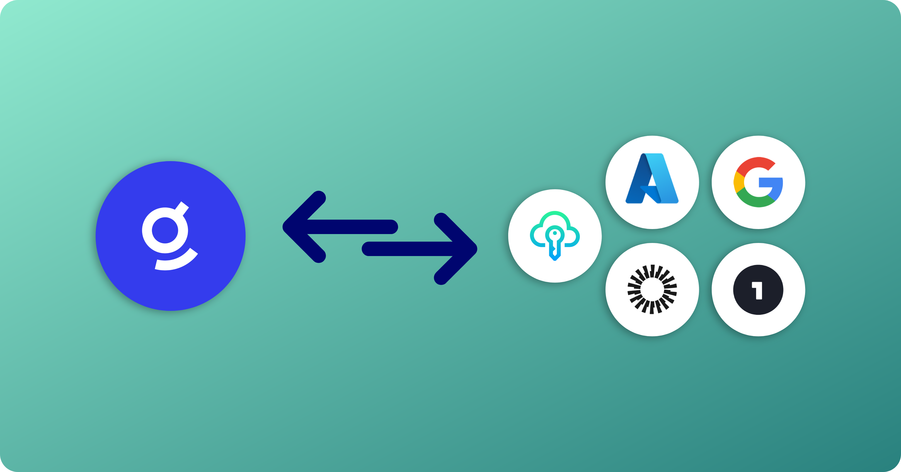
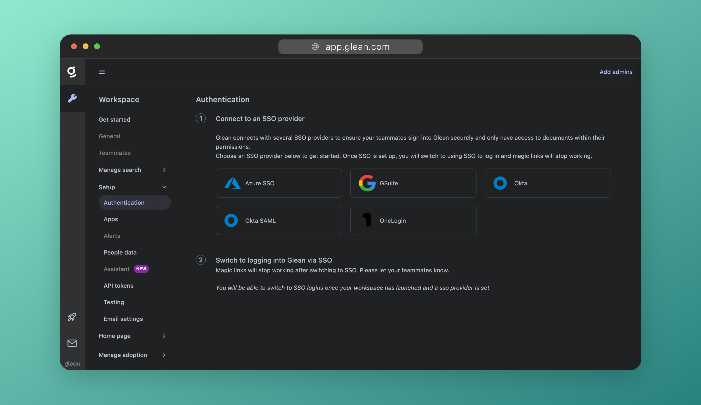
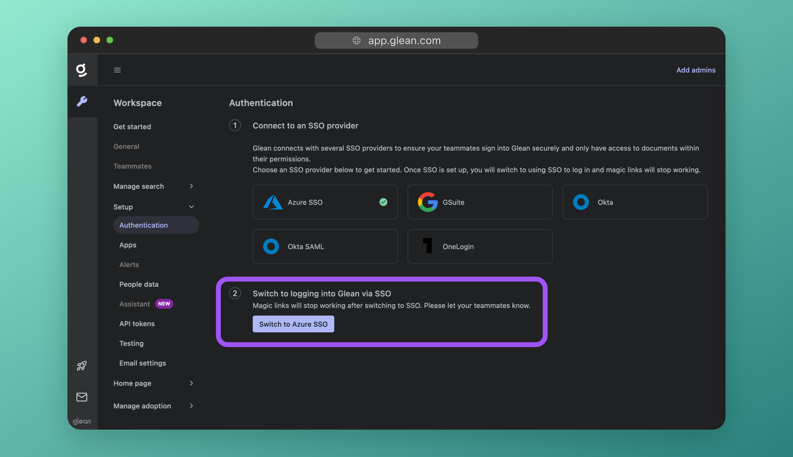
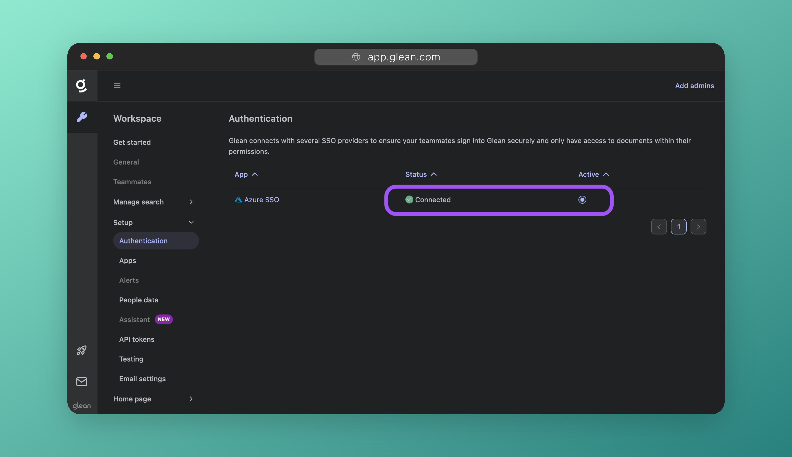

# Setup Single Sign-On (SSO)

In this section you will learn how to configure Single Sign-On (SSO) to provide seamless and secure employee access to Glean.

User information within your directory will be synchronized to Glean so that your organization's access permissions can be enforced in a user's search results.



## About Glean SSO
Glean uses OpenID Connect (OIDC) for SSO and directory synchronization, as it allows for fine grained control over permissions. All modern IdPs support OIDC, including Okta, Azure, and Google.

## Select your Identity Provider (IdP)
On the next screen (under **Setup** > **Authentication**), select your IdP from the list.



If you are using an older SSO service, eg: ADFS, you will need to use SAML instead of OIDC for SSO. To configure SAML, select **Okta SAML** from the list of IdPs.

!!! warning

     Glean strongly recommends you use an IdP that supports OIDC. SAML does not support directory synchonrization which is required for correct Glean operation.
     
     If you elect to use SAML, you will need to manually upload your directory information to Glean in CSV format.


## Configure SSO

Detailed instructions for configuring SSO with each IdP are linked below:

* Azure SSO
* Gsuite
* Okta
* Okta SAML
* OneLogin
* Other SAML (eg: ADFS)

## Enable SSO

!!! Info
    If your Glean tenant is still provisioning, you will not be able to enable SSO just yet. You will need to wait for your tenant build to complete before you can proceed. You can skip to the Configure Datasources step and return to this point later.

Once you have configured SSO, you will need to tell Glean to switch from using Magic Links to SSO for user sign-in.

Under the section **Switch to logging into Glean with SSO**, click the **Switch to ...** button.



Your page will refresh and you will see your IdP listed as **Connected** and **Active**.



## Test SSO

There are two key phases of SSO to test: The Glean (SP) to IdP redirect, and the IdP back to Glean redirect.

### Glean to IdP

To test your SSO configuration, open a new Incognito or **Private Browsing** window and navigate to [https://app.glean.com](https://app.glean.com). Enter your work email and click **Log In**.

You should be redirected to your SSO platform successfully.

??? Danger "Having issues?"
    If redirection to your SSO platform fails, and you are using OIDC, please contact Glean support.

    If you are using SAML, this indicates that the metadata provided to Glean (such as the Login URL) is incorrect. Please check your metadata and if the issue persists, contact Glean support.

### IdP to Glean

When you have been redirected to your SSO platform, attempt to sign in. You should be redirected back to Glean and and successfully signed in.

??? Danger "Having issues?"
    If you are able to sign in, but redirection back to Glean fails, check whether **BOTH** of the Authentication URLs provided by Glean for you to enter into your IdP have been set correctly.
    
    For OIDC these are:
    ```
    https://[tenant_name]-be.glean.com/authorization-code/callback?isExtension=1
    https://[tenant_name]-be.glean.com/authorization-code/callback
    ```
    If this does fix the issue, change the order of the URLs. If your issue persists, contact Glean support.


