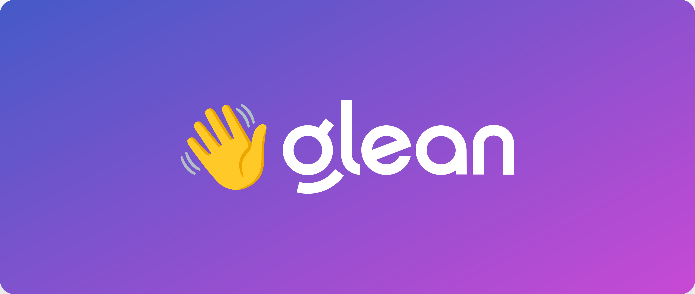

# Welcome to Glean!

Thank you for choosing Glean as your knowledge management solution. We're thrilled to have you on board and are committed to ensuring a smooth and successful setup for your organization.

## What is Glean?

Glean is a powerful tool designed to streamline your workspace by making information easily accessible. It allows you to search across various data sources, share knowledge with your team, and leverage advanced features for complex workflows.

In addition, Glean provides secure generative AI capabilities, similar to your organization's own dedicated ChatGPT or Bard, but securely trained on your organization's data. This means you don't need to worry about sensitive company data making its way outside the organization.

## Getting Started

As an administrator, you play a crucial role in setting up Glean for your organization. This guide will walk you through the process, providing step-by-step instructions for each stage of the setup.

Here's a brief overview of what you can expect:

* **[Access the Admin UI](adminui.md):** You will learn how to access the Glean Admin User Interface, where you will manage the Glean workspace for your company.

* **[Setup Single Sign-On (SSO)](sso.md):** You will set up SSO to ensure secure access to your Glean workspace.

* **[Sync People Data:](people-data.md)** You will learn how to sync people data, ensuring that your team's information is up-to-date in Glean.

* **[Configure Datasources](datasources.md):** You will connect Glean to various data sources, enabling your team to search across all your work applications.

* **[Setup Glean Assistant](assistant.md):** You will learn how to set up Glean Assistant: your organization's own personal ChatGPT/Bard.

Remember, our team is here to assist you every step of the way! If you have any questions or need further assistance, please get in touch with your Account Manager, SE, or CSM.

You can also raise a support ticket [here](https://support.glean.com/hc/en-us/requests/new){:target="_blank"}.