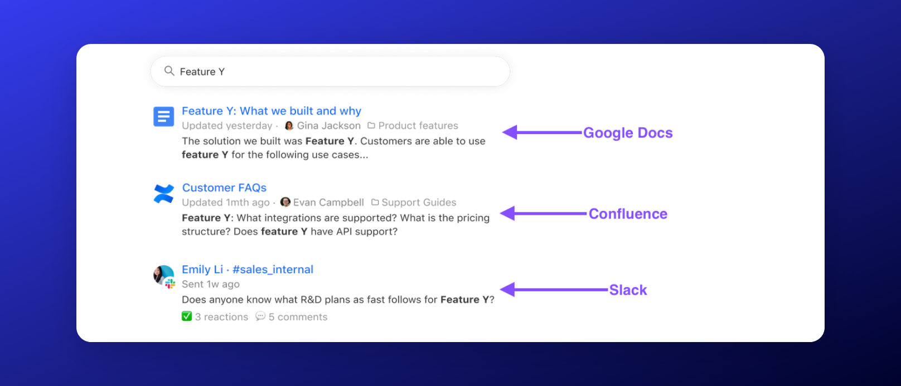
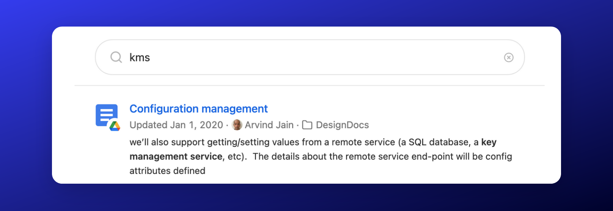
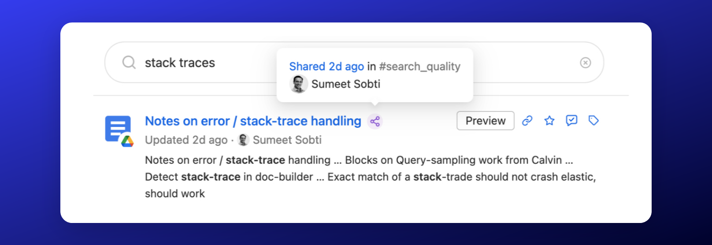
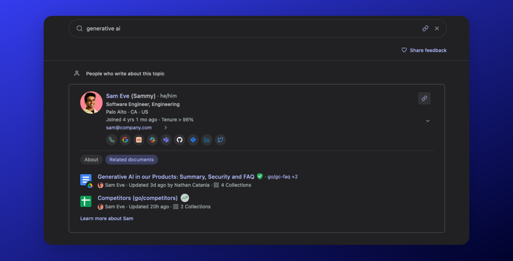
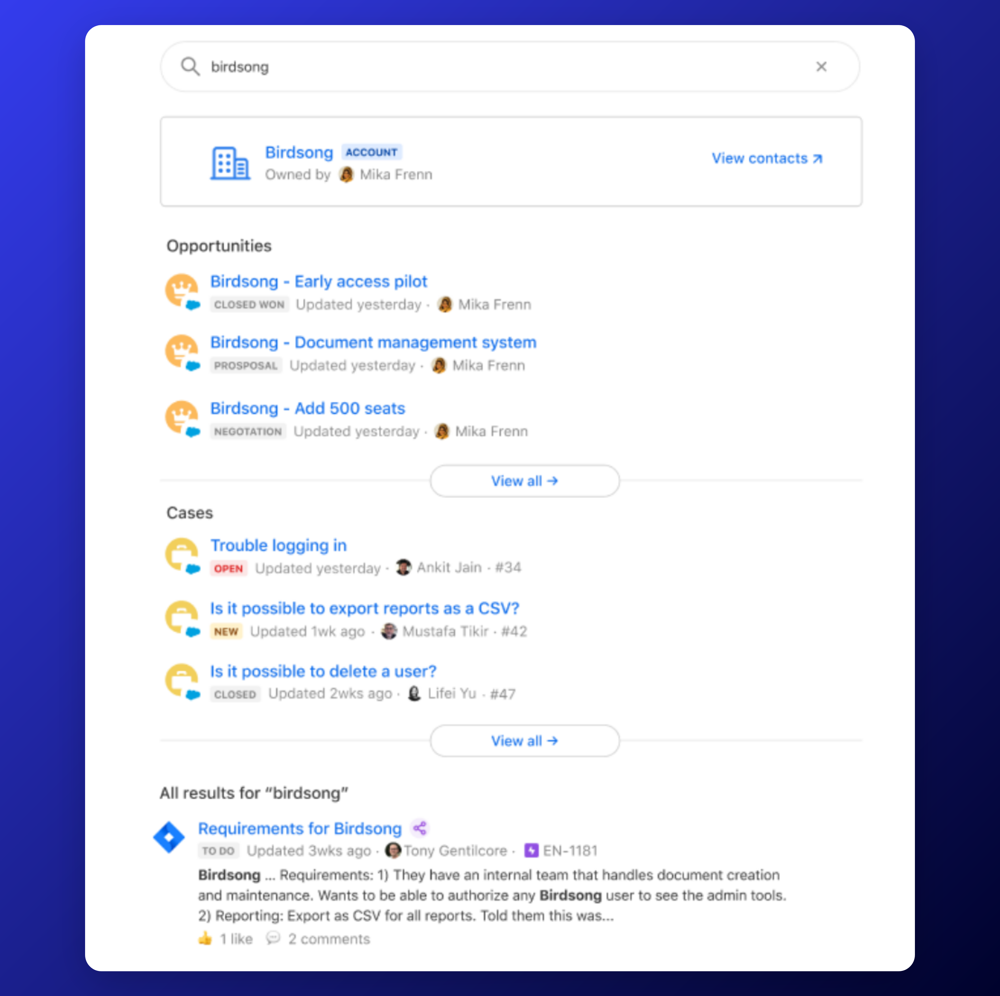
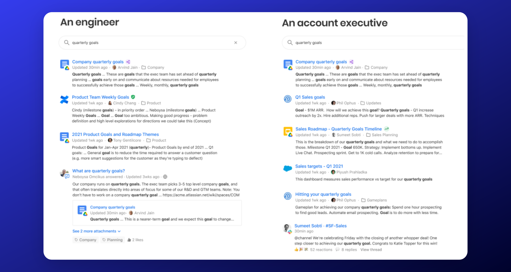
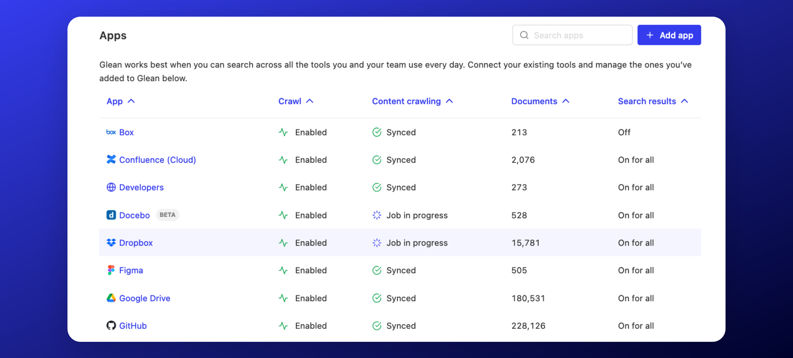
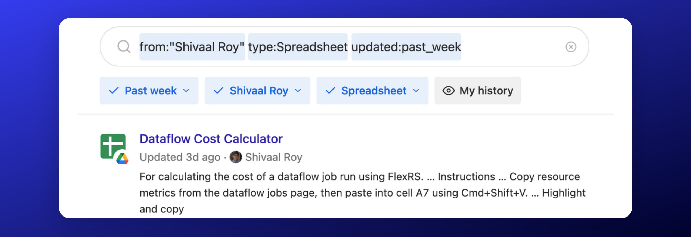

Glean Search is a powerful tool designed to help you find the information you need quickly and efficiently. It's more than just a search engine; it's a comprehensive solution that understands your company, your language, and your needs.

## Key Features of Glean Search

### Understands Your Content
Glean Search is designed to deliver great results from day one with no manual tuning required.

It searches across all aspects of your content, regardless of the app it is in, including document contents, comments, mentions, activity, attachments, messages, and more!

### Understands Natural Language
Glean understands natural human language powered by state-of-the-art deep learning techniques and Generative AI. This ensures that you get the right results, even when your search query might not match exactly.

Glean knows common industry acronyms and synonyms, and will learn about any unique synonyms and acronyms your organization uses as it indexes your content.

### Understands Your Company
Glean leverages all the activity within your company. This includes everything from visits to a document to shares of a document in other documents, or even conversations in Slack/Teams. The goal is to differentiate important content. To achieve this, Glean builds a complete graph of all your content. This comprehensive approach helps to surface the most important content for a specific query.

Glean’s natural language understanding model automatically learns your company’s language as well so that you don’t have to adjust how you search on Glean. 

### Understands People and Entities
Glean serves as an information aggregator across multiple tools, providing a comprehensive view of individuals within your company. If you need to learn more about a colleague or identify a subject-matter expert, Glean has you covered! 

Glean also compiles customer data from various sources such as Salesforce, Zendesk, and Jira; creating a 360-degree view of your customers in one place.

### Understands Your Users
Glean understands that every user's content needs are different depending on a variety of factors like their activity, role, department, team, manager, office location, etc.

Glean leverages what it knows about the user to personalize the results for them. For example: An engineer's view of search results for `quarterly goals` is very different from that of an account executive.

Glean uses state-of-the-art ML techniques to build a complete graph of who works with whom at a company to further personalize search results based on what people work on.

### Understands Changes
Glean constantly ingests new content as well as changes to existing content to ensure search results are fresh within a few minutes.

### Understands Power Users
For power users aiming to maximize the benefits of Glean, you have the option to utilize the filters in the user interface. Alternatively, you can simply type them out for quick access, ensuring you can take full advantage of all that Glean has to offer.

### Understands Your Metadata
Glean automatically crawls and incorporates any custom metadata from most sources, extending its capabilities even further.

For example, if your organization uses a custom Jira field named `leadership_priorities` with values `P0`, `P1`, and `P2`, Glean will make this available as a filter option. An example of how this might be used is `from:”Shivaal Roy” leadership_priorities:P0`

### Continuously Learns
Glean's ranking algorithm constantly learns and improves based on a user's activity in both Glean and all of your other tools.

For example: If a certain result is initially in the 5th position for a specific query, but multiple people access the document, then it will be boosted to a higher position for all future users based on relevancy.

Additionally, if a document is shared in Slack channels, then Glean will understand that it is a more important document based on the sharing activity.

## How to Use Glean Search
- **Search from Anywhere in the Document:** Simply input any phrases or keywords you recall from a document and let Glean do the rest.

- **Require Specific Words in Search Results:** By placing quotes around a word, you can ensure that it is included in the search results.

- **Find Teammates Quickly:** Input a colleague's name to swiftly access their contact information, view their position in the org chart, and see their recent documents and activities.