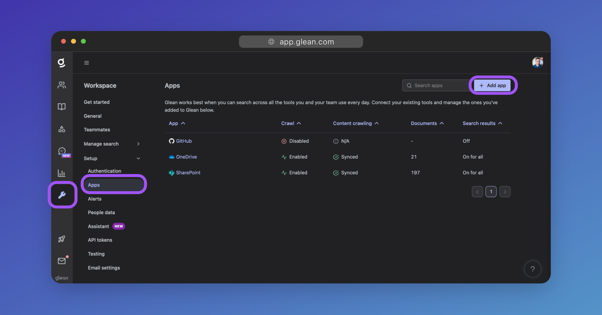
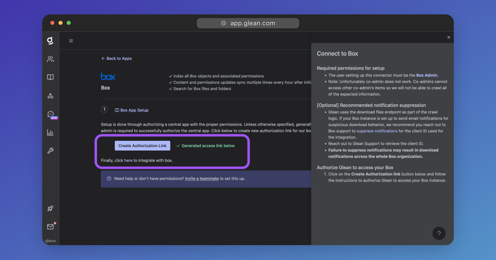
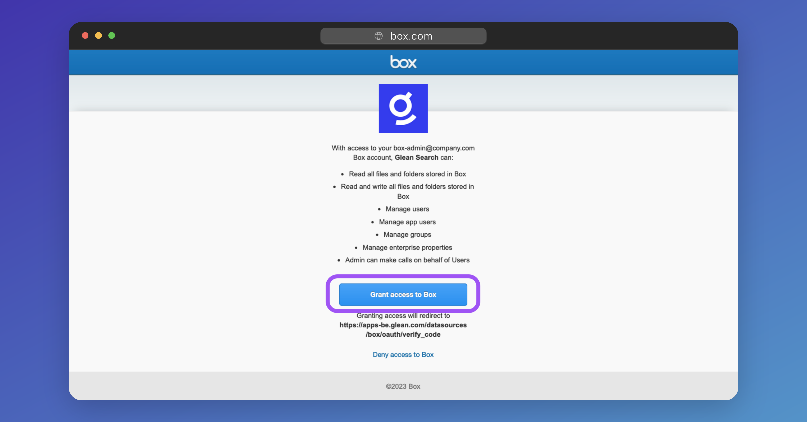

# Box Connector Configuration

## Required Permissions
- The user setting up this connector must be a [**Box Admin**](https://support.box.com/hc/en-us/articles/360043694174-Understanding-Administrator-and-Co-Administrator-Permissions).
- A user with the **Co-Admin** role **cannot** set up the Box connector. Doing so will cause the configuration and crawling to fail.

## Notification Suppression
* Glean uses the download files endpoint as part of the crawl logic to index file content.
* If your Box instance is set up to send email notifications for suspicious download behavior, we recommend you reach out to Box support to [suppress notifications](https://developer.box.com/guides/api-calls/suppress-notifications/){:target="_blank"} for Glean's Client ID used in the integration: `b7m82o7neyelnzc8sbtuq5hctfv0qn02`

!!! warning
    Failure to suppress notifications may result in download notifications across the whole Box organization.

## Process

### Add the Box Connector
In the Glean Admin UI, navigate to [Workspace Settings > Setup > Apps](https://app.glean.com/admin/setup/apps){:target="_blank"}, and then click the **+ Add App** button. When prompted, select **Box** from the list of apps (or [click here](https://app.glean.com/admin/setup/apps/box){:target="_blank"}).

### Create the Authorization Link
Click the **Create Authorization Link**.

When the link is created, click it to be taken to Box. You will be prompted to sign in to Box if you are not already.

### Authorize Glean
You will be prompted to authorize the Glean to access your Box instance.

Click **Grant access to Box**.

You will be re-directed back to the Glean Admin UI. Your Box instance is now connected to Glean.
### Start Crawling
Click on the **Overview** tab, and when prompted, the **Start Crawling** button to begin indexing your organization's Box content.

!!! success
    You Box instance is now connected to Glean, and Glean is now indexing your organization's Box content.

