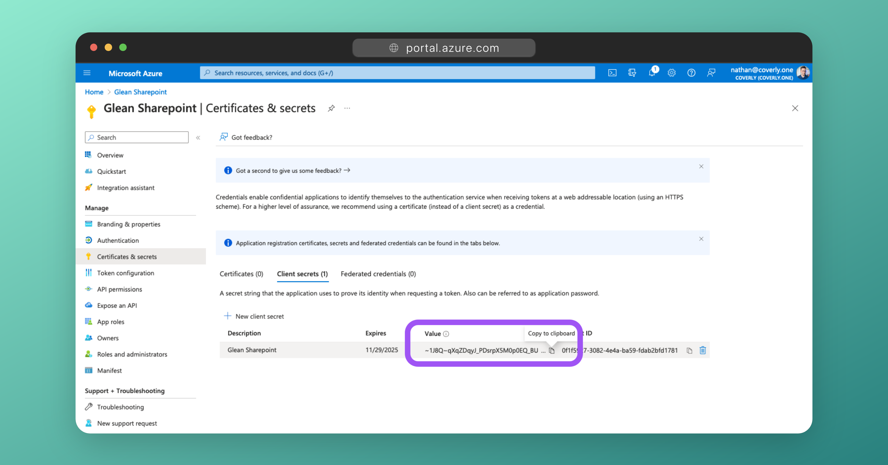

# OneDrive & SharePoint Connector Configuration

## Required permissions for setup
- The user setting up this connector must be the [Global Admin](https://learn.microsoft.com/en-us/microsoft-365/admin/add-users/about-admin-roles?view=o365-worldwide#commonly-used-microsoft-365-admin-center-roles){:target="_blank"} role.

## Create a new App Registration
1. Sign into the [Azure portal](https://portal.azure.com/){:target="_blank"}. Select **Microsoft Entra ID**, then **App registrations > New registration**.

    

3. Create a new App Registration with the following details and then click **Register**:

| Field                   | Value                                                                           |
|-------------------------|---------------------------------------------------------------------------------|
| Name                    | Glean SharePoint (can be whatever you like)                                     |
| Supported account types | Accounts in this organizational directory only ([Company] only - Single tenant) |
| Redirect URI            | (Leave this field blank)                                                        |


## Configure Graph API Permissions
1. On the left side navigation on the overview page, click on **=API Permissions**.

2. Click **Add a permission** and select **Microsoft Graph**. Choose **Application permissions** and add the following as **Application permissions**:

| Permission             | Detail                                                                                   |
|------------------------|------------------------------------------------------------------------------------------|
| `User.Read.All`        | List all the users within the directory (used for permissions)                           |
| `Group.Read.All`       | List all the groups within the directory (used for permissions)                          |
| `GroupMember.Read.All` | Get the members of a group (used for permissions)                                        |
| `Directory.Read.All`   | List all users within a tenant (used for permissions)                                    |
| `Files.Read.All`       | Retrieve items, metadata, and associated content from the item for the index.            |
| `Files.ReadWrite.All`  | Used to create and manage a webhook to subscribe to change notifications                 |
| `Reports.Read.All`     | Used for ranking signals                                                                 |
| `Sites.Read.All`       | Lists recent activities performed by the user on specific items.                         |

!!! danger "Error prevention"
    All permissions must be applied as **Application permissions**.
    
    If you use **Delegated permissions**, the connector will not be able to fetch content and the crawling will fail!

!!! danger "Error prevention"
    Make sure that you have applied all of the permissions listed above. If a permission is missing, crawling will fail!


## Approve Permissions
As the above permissions use Application permissions, they must be approved by a Global, Application, or Cloud Application Administrator.

1. Ensure you are signed into Azure as a Global, Application or Cloud Application Administrator.

2. Navigate to the **App Registrations > Glean Sharepoint > API Permissions**.

3. Click the **Grant admin consent for [company]** button, followed by **Yes** to grant admin consent for these permissions.


## Generate a Secret

1. From the left sidebar, click on **Certificates & secrets**, then **New client secret**.

2. Enter a description, eg: `Glean Sharepoint Secret`, select **24 months** for expiry time, and click **Add**.

    

3. Under **Client secrets**, copy the **Value** (not the **Secret ID**) generated and enter it into the Glean Admin UI as the **Client secret**. The value will only be shown once.

    


## Copy the Application & Directory IDs

1. From the left sidebar, click on **Overview**.

2. Copy the values for **Application (client) ID** and **Directory (tenant) ID**. Enter these into the Glean Admin UI where indicated.


## Populate Credentials in Glean

1. Ensure that the **Client secret**, **Application (client) ID**, and **Directory (tenant) ID** are populated in the Glean Admin UI.

2. Enter your Sharepoint domain in Glean. Your Sharepoint domain will be of the form `company.sharepoint.com`. Ensure the full domain is entered.

3. Set **Tenant Size** to the correct value based on the number of employees that your company has.

!!! warning
    Tenant size helps Glean scale the crawler for your SharePoint & OneDrive instances correctly. Entering an incorrect size will cause your crawl rate to be slow.

4. Check the **Enable OneDrive user drives crawl** option to crawl OneDrive in addition to SharePoint.


## Add Additional Apps
SharePoint and OneDrive are often the largest sources of content for most organizations, however, the Microsoft Graph API tends to have a lower rate limit which is not ideal for crawling large amounts of content quickly.

To increase crawl speeds, you can repeat the steps above and create multiple "Glean Sharepoint" App Registrations in Azure AD/Entra ID with the same permissions. When provided with the Application IDs and Client Secrets for these additional apps, Glean can utilize them in parallel to speed up the rate at which your SharePoint and OneDrive content is crawled.

!!! tip
    Glean strongly recommends that you configure between 3-5 additional applications, depending on the size of your organization.

1. In the Glean UI, under **#3 Setup additional apps**, click the **Add additional app** button. This will prompt you to add in another Application (client) ID and Secret.

    

3. For each additional app you wish to add, follow the steps above again:
    * Create a new App Registration (eg: `Glean SharePoint Additional 1`, `Glean SharePoint Additional 2`, etc).
    * Add the correct permissions.
    * Generate and copy a Client Secret key.
    * Copy the Application (client) ID.
    * Paste both the Client Secret key and Application (client) ID into the Glean UI.

4. Once you have finished adding the details for the additional apps, DO NOT click Save just yet.


## Configure SharePoint REST API Permissions
Some SharePoint content (like classic sites, and permissions for site pages) is not obtainable from the Graph API, so Glean must use the dedicated [SharePoint REST API](https://learn.microsoft.com/en-us/sharepoint/dev/sp-add-ins/get-to-know-the-sharepoint-rest-service?tabs=csom){:target="_blank"} instead.

!!! info
    You will need to follow this section to enable the SharePoint REST API permissions for each additional app created above, or they will not function correctly.


1. Navigate to:
    ```
    <sharepoint-domain>-admin.sharepoint.com/_layouts/15/appinv.aspx
    ```
    Eg: If your Sharepoint domain is `company.sharepoint.com`, go to `company-admin.sharepoint.com/_layouts/15/appinv.aspx`

2. For every Sharepoint app created (the parent app and all additional apps), complete the following:

    1.  For **App Id**, paste in the Application (client) ID value and click the **Lookup** button. The **Title** field will automatically populate with the name of the associated App Registration (eg: `Glean SharePoint`)

    2.  For **App Domain** enter:
        ```
        glean.com
        ```

    3.  For **Redirect URL** enter:
        ```
        https://glean.com
        ```

    4.  In the **Permission Request XML** field, paste the following:
        ```
        <AppPermissionRequests AllowAppOnlyPolicy="true"> <AppPermissionRequest Scope="http://sharepoint/content/tenant" Right="FullControl" /> <AppPermissionRequest Scope="http://sharepoint/content/sitecollection" Right="FullControl" /> <AppPermissionRequest Scope="http://sharepoint/content/sitecollection/web" Right="FullControl" /></AppPermissionRequests>
        ```

    5. Click **Create** to apply the permissions.

    6. Repeat steps a-e for each additional app.


!!! question "Why is FullControl necessary on the REST API permissions?"
    The SharePoint REST API unfortunately does not provide information on the permissions for each site when querying the API with ReadOnly. This data is only obtainable via the SharePoint REST API when FullControl permissions are used. Furthermore, this information is not obtainable at all using the Graph API.
    
    Site Permissions data is critical for Glean to ensure that permissions are enforced in a user's search results. As soon as it becomes possible to obtain site permission data using Read Only permissions and/or via the Graph API, we will remove the requirement for FullControl.

    For more information, please see [this StackOverflow post](https://stackoverflow.com/questions/66324448/unexpected-403-in-sharepoint-rest-api-list-items-roleassignments-call#comment125858296_66324448).

    
## Validate Settings
Back in the Glean UI, click **Save**. Glean will go through and validate that all of the required permissions for each SharePoint app (both in the Graph API and SharePoint REST API) have been granted.

Depending upon the age of your SharePoint Online tenant, you might receive the following error:
```
Unable to fetch O365 Sharepoint site groups. Please check that the sharepoint/content/tenant and sharepoint/content/sitecollection scopes are enabled with FullControl for Sharepoint REST API.
```

**This is normal!**

If your SharePoint Online tenant is newer (typically 2020 onwards), then the method of authenticating to the SharePoint REST API ([Azure Access Control Services (ACS)](https://learn.microsoft.com/en-us/sharepoint/dev/solution-guidance/security-apponly-azureacs){:target="_blank"}) is disabled by default. This was enabled by default in older tenants to assist with migration from SharePoint on-premises.

To use the SharePoint REST API, we need to enable ACS. You can enable ACS using PowerShell:

1. Install the required modules:
```
Install-Module -Name PnP.PowerShell
Install-Module -Name Microsoft.Online.SharePoint.PowerShell
```

2. Connect to your SharePoint domain:
```
Connect-PnPOnline -Url https://<sharepointdomain>-admin.sharepoint.com
```

3. Enable ACS:
```
Set-PnPTenant -DisableCustomAppAuthentication $false
```

4. Attempt to click **Save** again in the Glean UI. Your settings should now validate successfully.


## Finish

!!! success
    You have successfully connected SharePoint and OneDrive to Glean!

If you wish to apply restrictions to the content that Glean does/does not crawl, you should apply these restrictions BEFORE starting a crawl. Restrictions can be applied from the **Manage data** tab of the SharePoint connector, or by contacting Glean.

For more information on what restrictions can be applied, [click here](restrict-m365.md).