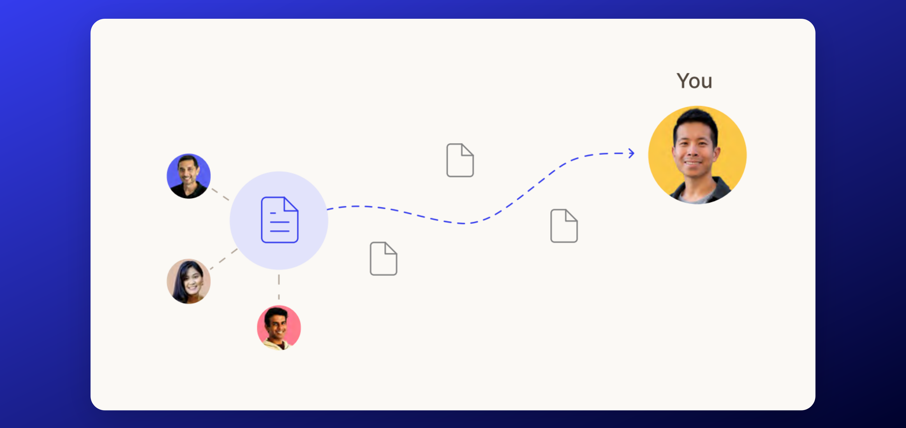
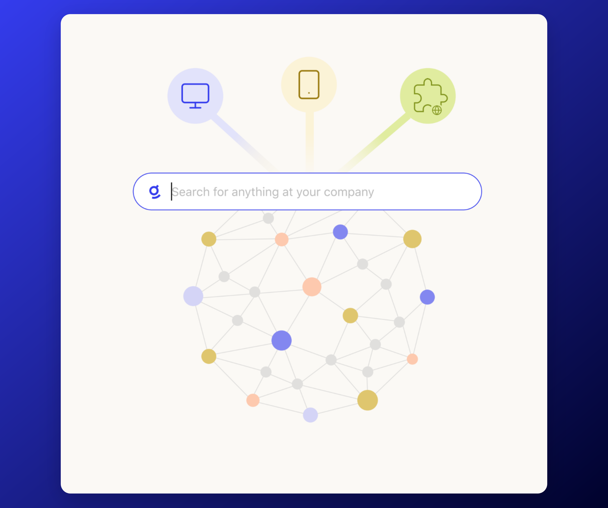
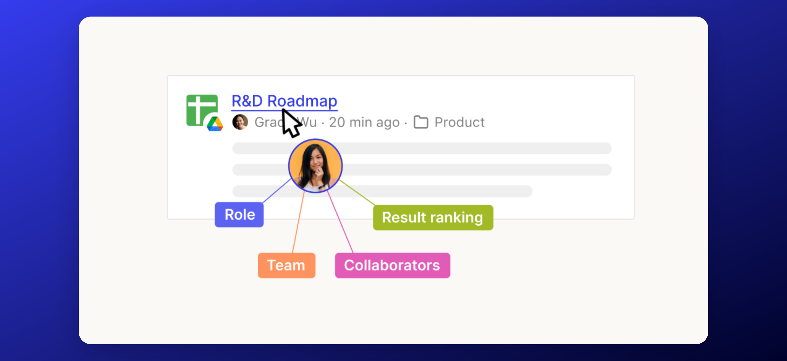

The Glean Knowledge Graph is a powerful tool that forms the backbone of Glean's enterprise search platform. It is designed to provide users with the most personalized and relevant results for their queries.

## About the Glean Knowledge Graph
Glean's unique search engine operates based on a real-time model of your enterprise's indexed information – the enterprise knowledge graph.

This system involves three key pillars: **Content**, **People**, **Activity**.

### Content
Filling the knowledge graph with content begins with our easy-to-use 100+ connectors. Each connector is tailor-made for each application’s unique data model and API endpoints, requires no additional professional services to use, and is fully permissions-aware – ensuring all accessibility and sharing protocols are strictly followed for each source.

Through these connectors, Glean's content crawler searches over every part of a piece of content, not just the title. This involves relevant item content (titles, body copy, comments, media, etc.), as well as metadata (file creator, time of creation, update history, file type, folder structure, etc).

All of these elements, stored within the knowledge graph’s index, become readily searchable. Customizable weights can also be set for specific categories to influence search results. Facet search results can be tuned based on metadata fields specific to each app.

Permissions can also be individually set for specific items. Files can be selectively included or excluded from Glean's crawl system by specifying asset IDs or by a broader categorization, such as item containers (folders or drives).

Content crawl strategy is also completely tunable according to your organization's preference. Adjust crawl cadence, assign blackout hours to avoid peak work hours, and shift between different crawl methodologies to ensure your knowledge graph contains the most relevant and up-to-date information throughout the day.

### People
One out of ten enterprise searches are about people. It makes good sense – workers want to know exactly who they're working with, what their role is, and what they've most recently worked on. Glean facilitates this by aggregating data across multiple tools, providing a comprehensive and information-rich view of anyone in the company.

Our engine is also capable of providing deeply personalized and permissions-aware results, especially as it better understands each individual’s role within an organization.

Glean builds each enterprise's knowledge graph with a deep understanding of the people within, such as what their role is which team they're on, their tenure, and location. Our system is then capable of constructing a unified identity for each person across all apps, along with a holistic organization structure that understands everything from each person's closest collaborators to what projects they've most recently worked on.

The underlying data model and individual sources of information used to build these profiles can be customized according to preference.

### Activity
Glean collects activity data from several apps (Teams, Slack, email, plugins, Chrome extension, etc.) to index critical signals required for better search personalization and relevance. We only collect activity on sources connected to the product. As mentioned, none of this activity information ever leaves your exclusive GCP project, and follows strict data protection rules to ensure privacy.

The activity information is used in two ways:

* **Learning what information matters most to better personalize results for users** – individual user data does not leak over to any other user.

* **Improving personalization for a collection of users** – privacy thresholds ensure data is only collected when we see a common datapoint across multiple users.

Understanding activity enables Glean to better detect sharing and usage patterns, and provide more personalized search results by adjusting ranking based on your activity and that of your teammates.

Is there an exceptional piece of enablement content that your team’s been circulating often lately? New checklist your IT team’s been referring to during audit season? Latest corporate branding guidelines your design team’s been working on? Glean already knows they’re in high-demand, and that you’ll want to see it as well.

## Knowledge Graph in Search
Once all this information is collected, Glean then compiles it into a central search index.

Users can then send in queries through either the web app, mobile app, or browser extension to begin discovering what they need to know through the compiled search index.

Once the searcher locates what they need and completes the search, Glean stores any information relevant to this search session to improve future searches. This includes data such as the resulting file they clicked on, which team they’re on their role, and the ranking of the result.

Compared to search solutions that rely on federated search – which runs every query through multiple search APIs that need to be individually authorized for search – Glean’s indexing system keeps company data frequently updated, and results consistently fresh, accurate, and quick to load.

